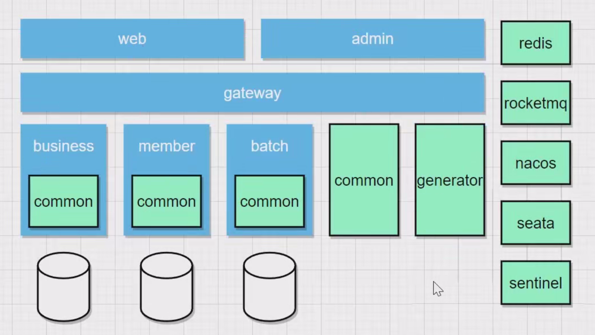
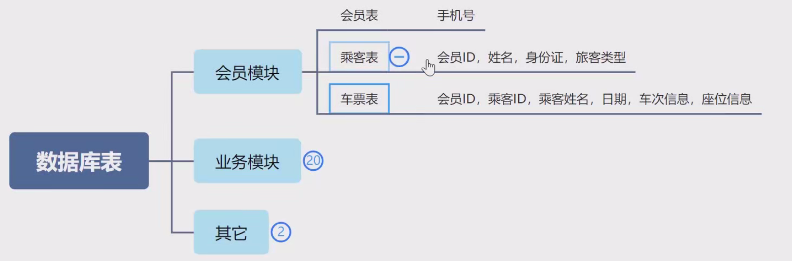
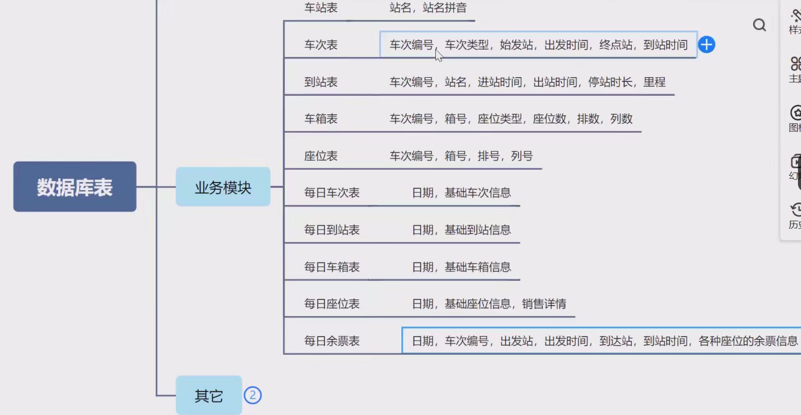
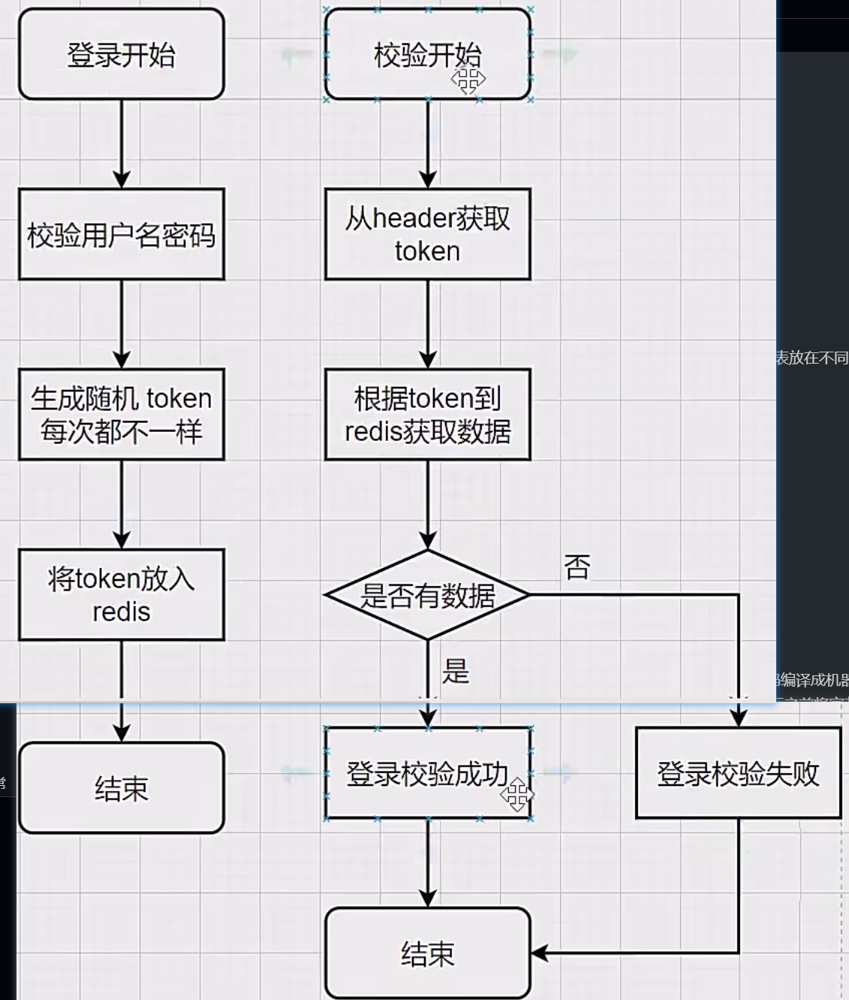
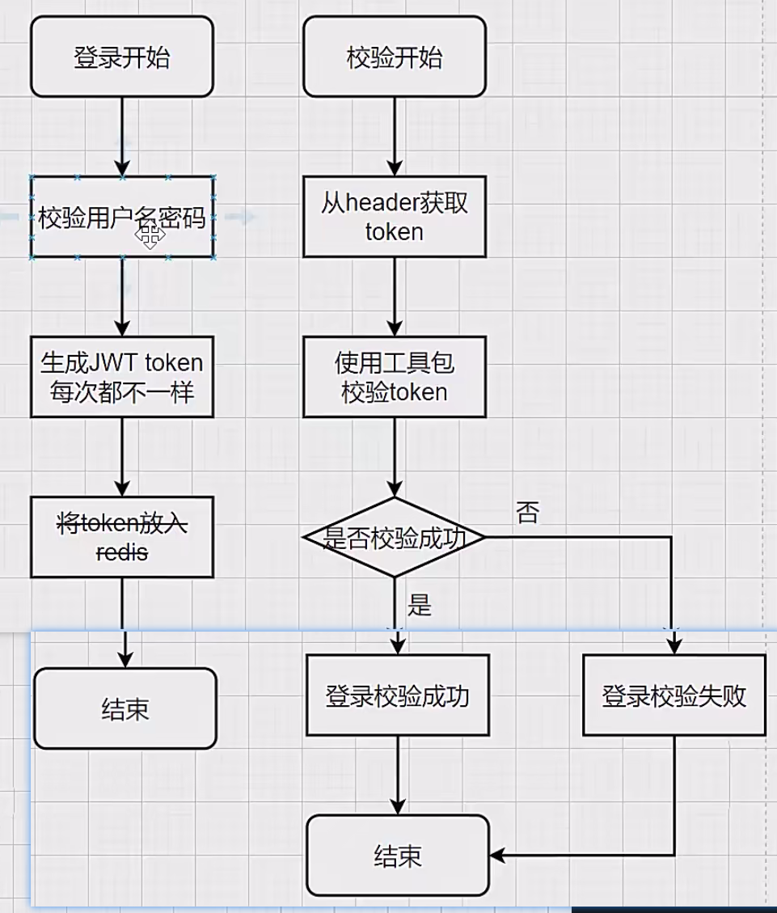
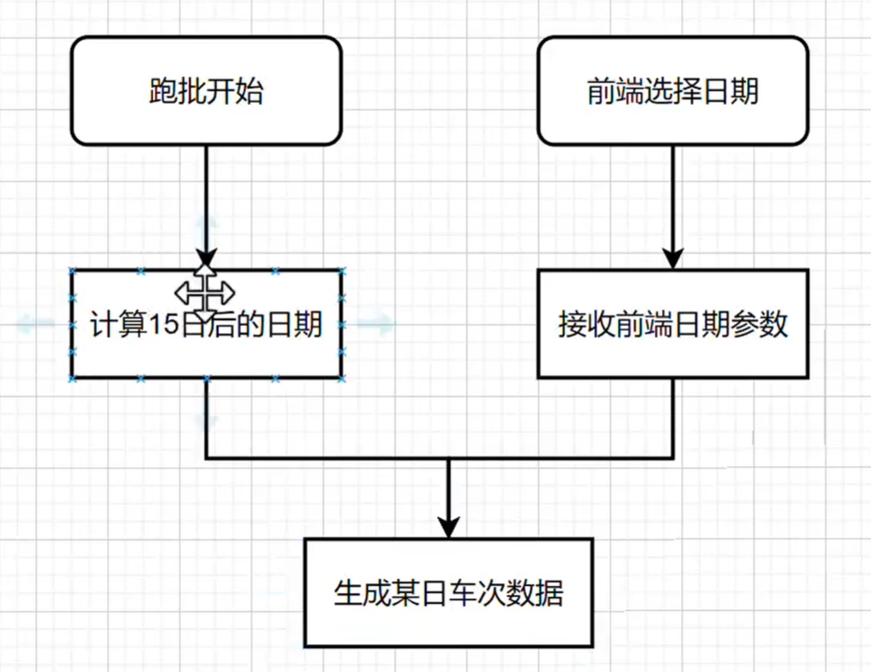
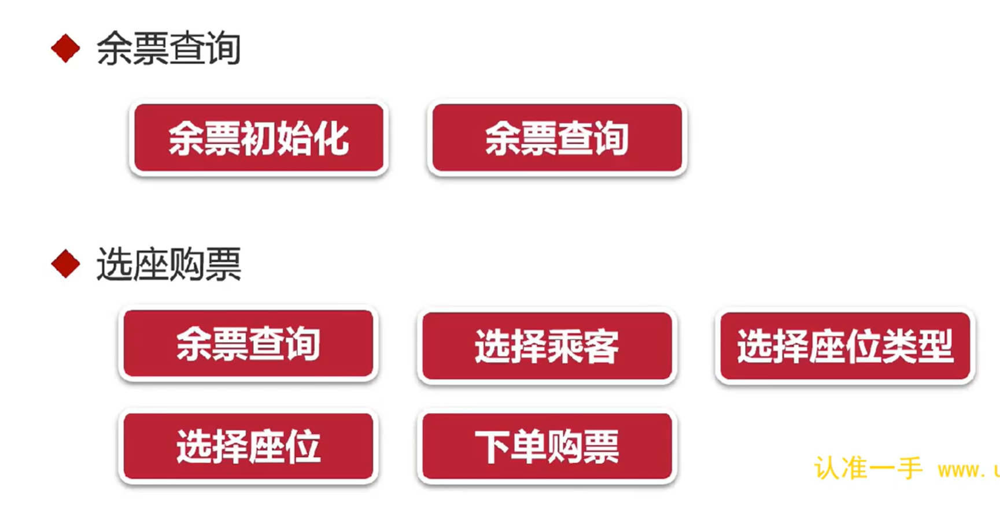
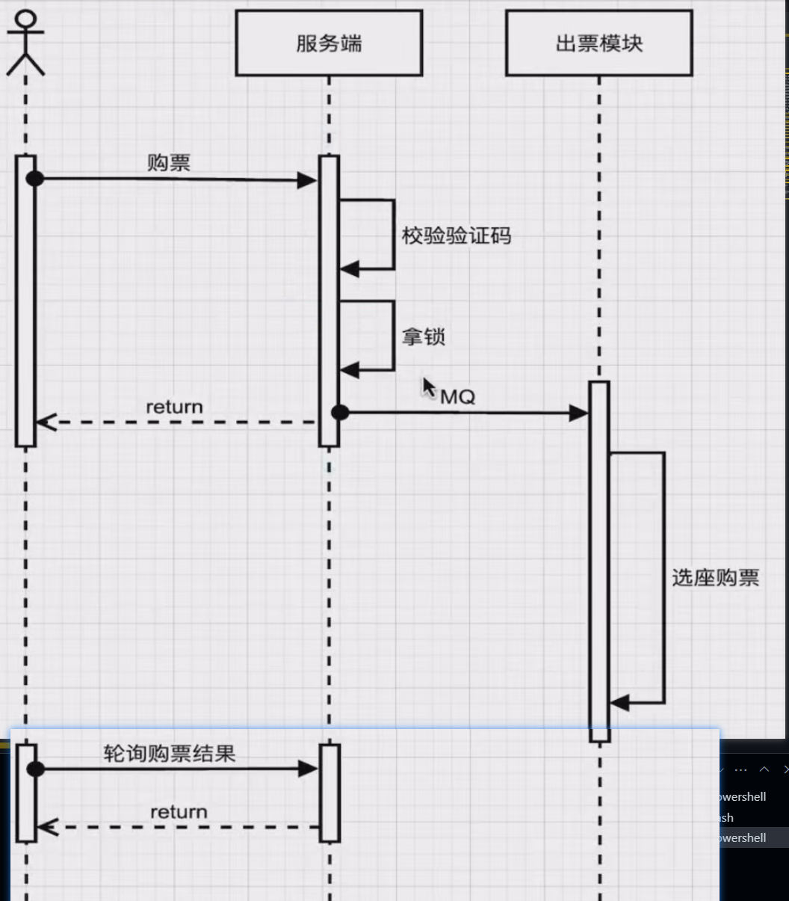
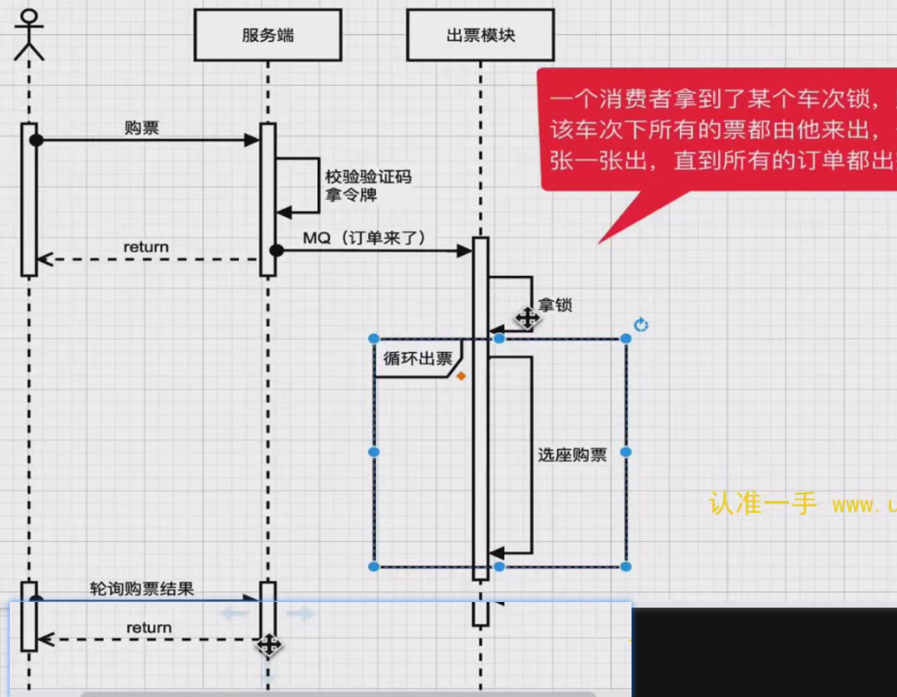

# 仿12306售票系统实战开发
## 第二章
### 12306架构图


### 数据库表


```sql
drop table if exists `station`;
create table `station` (
                           `id` bigint not null comment 'id',
                           `name` varchar(20) not null comment '站名',
                           `name_pinyin` varchar(50) not null comment '站名拼音',
                           `name_py` varchar(50) not null comment '站名拼音首字母',
                           `create_time` datetime(3) comment '新增时间',
                           `update_time` datetime(3) comment '修改时间',
                           primary key (`id`),
                           unique key `name_unique` (`name`)
) engine=innodb default charset=utf8mb4 comment='车站';

drop table if exists `train`;
create table `train` (
                         `id` bigint not null comment 'id',
                         `code` varchar(20) not null comment '车次编号',
                         `type` char(1) not null comment '车次类型|枚举[TrainTypeEnum]',
                         `start` varchar(20) not null comment '始发站',
                         `start_pinyin` varchar(50) not null comment '始发站拼音',
                         `start_time` time not null comment '出发时间',
                         `end` varchar(20) not null comment '终点站',
                         `end_pinyin` varchar(50) not null comment '终点站拼音',
                         `end_time` time not null comment '到站时间',
                         `create_time` datetime(3) comment '新增时间',
                         `update_time` datetime(3) comment '修改时间',
                         primary key (`id`),
                         unique key `code_unique` (`code`)
) engine=innodb default charset=utf8mb4 comment='车次';

drop table if exists `train_station`;
create table `train_station` (
                                 `id` bigint not null comment 'id',
                                 `train_code` varchar(20) not null comment '车次编号',
                                 `index` int not null comment '站序',
                                 `name` varchar(20) not null comment '站名',
                                 `name_pinyin` varchar(50) not null comment '站名拼音',
                                 `in_time` time comment '进站时间',
                                 `out_time` time comment '出站时间',
                                 `stop_time` time comment '停站时长',
                                 `km` decimal(8, 2) not null comment '里程（公里）|从上一站到本站的距离',
                                 `create_time` datetime(3) comment '新增时间',
                                 `update_time` datetime(3) comment '修改时间',
                                 primary key (`id`),
                                 unique key `train_code_index_unique` (`train_code`, `index`),
                                 unique key `train_code_name_unique` (`train_code`, `name`)
) engine=innodb default charset=utf8mb4 comment='火车车站';

drop table if exists `train_carriage`;
create table `train_carriage` (
                                  `id` bigint not null comment 'id',
                                  `train_code` varchar(20) not null comment '车次编号',
                                  `index` int not null comment '厢号',
                                  `seat_type` char(1) not null comment '座位类型|枚举[SeatTypeEnum]',
                                  `seat_count` int not null comment '座位数',
                                  `row_count` int not null comment '排数',
                                  `col_count` int not null comment '列数',
                                  `create_time` datetime(3) comment '新增时间',
                                  `update_time` datetime(3) comment '修改时间',
                                  unique key `train_code_index_unique` (`train_code`, `index`),
                                  primary key (`id`)
) engine=innodb default charset=utf8mb4 comment='火车车厢';

drop table if exists `train_seat`;
create table `train_seat` (
                              `id` bigint not null comment 'id',
                              `train_code` varchar(20) not null comment '车次编号',
                              `carriage_index` int not null comment '厢序',
                              `row` char(2) not null comment '排号|01, 02',
                              `col` char(1) not null comment '列号|枚举[SeatColEnum]',
                              `seat_type` char(1) not null comment '座位类型|枚举[SeatTypeEnum]',
                              `carriage_seat_index` int not null comment '同车厢座序',
                              `create_time` datetime(3) comment '新增时间',
                              `update_time` datetime(3) comment '修改时间',
                              primary key (`id`)
) engine=innodb default charset=utf8mb4 comment='座位';

drop table if exists `daily_train`;
create table `daily_train` (
                               `id` bigint not null comment 'id',
                               `date` date not null comment '日期',
                               `code` varchar(20) not null comment '车次编号',
                               `type` char(1) not null comment '车次类型|枚举[TrainTypeEnum]',
                               `start` varchar(20) not null comment '始发站',
                               `start_pinyin` varchar(50) not null comment '始发站拼音',
                               `start_time` time not null comment '出发时间',
                               `end` varchar(20) not null comment '终点站',
                               `end_pinyin` varchar(50) not null comment '终点站拼音',
                               `end_time` time not null comment '到站时间',
                               `create_time` datetime(3) comment '新增时间',
                               `update_time` datetime(3) comment '修改时间',
                               primary key (`id`),
                               unique key `date_code_unique` (`date`, `code`)
) engine=innodb default charset=utf8mb4 comment='每日车次';

drop table if exists `daily_train_station`;
create table `daily_train_station` (
                                       `id` bigint not null comment 'id',
                                       `date` date not null comment '日期',
                                       `train_code` varchar(20) not null comment '车次编号',
                                       `index` int not null comment '站序|第一站是0',
                                       `name` varchar(20) not null comment '站名',
                                       `name_pinyin` varchar(50) not null comment '站名拼音',
                                       `in_time` time comment '进站时间',
                                       `out_time` time comment '出站时间',
                                       `stop_time` time comment '停站时长',
                                       `km` decimal(8, 2) not null comment '里程（公里）|从上一站到本站的距离',
                                       `create_time` datetime(3) comment '新增时间',
                                       `update_time` datetime(3) comment '修改时间',
                                       primary key (`id`),
                                       unique key `date_train_code_index_unique` (`date`, `train_code`, `index`),
                                       unique key `date_train_code_name_unique` (`date`, `train_code`, `name`)
) engine=innodb default charset=utf8mb4 comment='每日车站';

drop table if exists `daily_train_carriage`;
create table `daily_train_carriage` (
                                        `id` bigint not null comment 'id',
                                        `date` date not null comment '日期',
                                        `train_code` varchar(20) not null comment '车次编号',
                                        `index` int not null comment '箱序',
                                        `seat_type` char(1) not null comment '座位类型|枚举[SeatTypeEnum]',
                                        `seat_count` int not null comment '座位数',
                                        `row_count` int not null comment '排数',
                                        `col_count` int not null comment '列数',
                                        `create_time` datetime(3) comment '新增时间',
                                        `update_time` datetime(3) comment '修改时间',
                                        primary key (`id`),
                                        unique key `date_train_code_index_unique` (`date`, `train_code`, `index`)
) engine=innodb default charset=utf8mb4 comment='每日车厢';

drop table if exists `daily_train_seat`;
create table `daily_train_seat` (
                                    `id` bigint not null comment 'id',
                                    `date` date not null comment '日期',
                                    `train_code` varchar(20) not null comment '车次编号',
                                    `carriage_index` int not null comment '箱序',
                                    `row` char(2) not null comment '排号|01, 02',
                                    `col` char(1) not null comment '列号|枚举[SeatColEnum]',
                                    `seat_type` char(1) not null comment '座位类型|枚举[SeatTypeEnum]',
                                    `carriage_seat_index` int not null comment '同车箱座序',
                                    `sell` varchar(50) not null comment '售卖情况|将经过的车站用01拼接，0表示可卖，1表示已卖',
                                    `create_time` datetime(3) comment '新增时间',
                                    `update_time` datetime(3) comment '修改时间',
                                    primary key (`id`)
) engine=innodb default charset=utf8mb4 comment='每日座位';

drop table if exists `daily_train_ticket`;
create table `daily_train_ticket` (
                                      `id` bigint not null comment 'id',
                                      `date` date not null comment '日期',
                                      `train_code` varchar(20) not null comment '车次编号',
                                      `start` varchar(20) not null comment '出发站',
                                      `start_pinyin` varchar(50) not null comment '出发站拼音',
                                      `start_time` time not null comment '出发时间',
                                      `start_index` int not null comment '出发站序|本站是整个车次的第几站',
                                      `end` varchar(20) not null comment '到达站',
                                      `end_pinyin` varchar(50) not null comment '到达站拼音',
                                      `end_time` time not null comment '到站时间',
                                      `end_index` int not null comment '到站站序|本站是整个车次的第几站',
                                      `ydz` int not null comment '一等座余票',
                                      `ydz_price` decimal(8, 2) not null comment '一等座票价',
                                      `edz` int not null comment '二等座余票',
                                      `edz_price` decimal(8, 2) not null comment '二等座票价',
                                      `rw` int not null comment '软卧余票',
                                      `rw_price` decimal(8, 2) not null comment '软卧票价',
                                      `yw` int not null comment '硬卧余票',
                                      `yw_price` decimal(8, 2) not null comment '硬卧票价',
                                      `create_time` datetime(3) comment '新增时间',
                                      `update_time` datetime(3) comment '修改时间',
                                      primary key (`id`),
                                      unique key `date_train_code_start_end_unique` (`date`, `train_code`, `start`, `end`)
) engine=innodb default charset=utf8mb4 comment='余票信息';

drop table if exists `confirm_order`;
create table `confirm_order` (
                                 `id` bigint not null comment 'id',
                                 `member_id` bigint not null comment '会员id',
                                 `date` date not null comment '日期',
                                 `train_code` varchar(20) not null comment '车次编号',
                                 `start` varchar(20) not null comment '出发站',
                                 `end` varchar(20) not null comment '到达站',
                                 `daily_train_ticket_id` bigint not null comment '余票ID',
                                 `tickets` json not null comment '车票',
                                 `status` char(1) not null comment '订单状态|枚举[ConfirmOrderStatusEnum]',
                                 `create_time` datetime(3) comment '新增时间',
                                 `update_time` datetime(3) comment '修改时间',
                                 primary key (`id`),
                                 index `date_train_code_index` (`date`, `train_code`)
) engine=innodb default charset=utf8mb4 comment='确认订单';

CREATE TABLE `undo_log` (
                            `id` bigint(20) NOT NULL AUTO_INCREMENT,
                            `branch_id` bigint(20) NOT NULL,
                            `xid` varchar(100) NOT NULL,
                            `context` varchar(128) NOT NULL,
                            `rollback_info` longblob NOT NULL,
                            `log_status` int(11) NOT NULL,
                            `log_created` datetime NOT NULL,
                            `log_modified` datetime NOT NULL,
                            `ext` varchar(100) DEFAULT NULL,
                            PRIMARY KEY (`id`),
                            UNIQUE KEY `ux_undo_log` (`xid`,`branch_id`)
) ENGINE=InnoDB AUTO_INCREMENT=1 DEFAULT CHARSET=utf8;

drop table if exists `sk_token`;
create table `sk_token` (
                            `id` bigint not null comment 'id',
                            `date` date not null comment '日期',
                            `train_code` varchar(20) not null comment '车次编号',
                            `count` int not null comment '令牌余量',
                            `create_time` datetime(3) comment '新增时间',
                            `update_time` datetime(3) comment '修改时间',
                            primary key (`id`),
                            unique key `date_train_code_unique` (`date`, `train_code`)
) engine=innodb default charset=utf8mb4 comment='秒杀令牌';

```
### 百万人抢一万张票，系统如何保证其正常及稳定性（持续秒杀高并发技术）
* 前端
  * 针对静态资源做CDN
  * 页面静态化
  * 倒计时&Loading
  * 使用验证码削峰
* 后端
  * 微服务-服务拆分
  * 负载均衡
  * 限流降级
  * 缓存
  * 令牌
  * 异步处理
* 数据库
  * 分库：业务分库、读写分离（将不同业务的表放在不同的数据库里，相互隔离）
  * 分表：横向分表、纵向分表
  * 冗余设计、反范式、空间换时间
  * 分布式数据库
* 其他
  * 分时段秒杀
  * 弹性扩容
  * 候补+排队

### 2. SpringBoot3新特性
#### 2.1 AOT和JIT
JIT(Just In Time)：即时编译，JVM在运行时将字节码编译成机器码，以提高运行效率。
AOT(Ahead Of Time)：预编译，JVM在运行之前将字节码编译成机器码，以提高启动速度。
AOT的优点：
* 启动和运行速度快
* 打包体积小
缺点：
* 编译后的程序不支持跨平台
* buzhichi动态功能，如AOP

并发生成问题：热点应用重启后，出现业务超时， 几分钟后恢复正常
解决方法：
* 预热：初始让程序自动运行热点代码几百次
* 流量控制：启动时小流量，运行几分钟后再放到正常流量
  
网关模块：生产发布时，只有gateway需要配置外网IP，其他模块都只开放内网访问，外网访问不了，保证应用安全

### 3. 数据库
mysql8.0安装
* 下载镜像：docker pull mysql:8.0.20
* 启动镜像：docker run -p 3307:3306 --name mysql8 -e MYSQL_ROOT_PASSWORD=123456 -d mysql:8.0.20
* 创建挂载目录：mkdir -p /docker/mysql8.0.20/


## 第四章
### 4.20 详解雪花算法
生成ID的方式：
    * 自增ID不适合分布式数据库，分表分库场景，适合小型项目
    * UUID会影响索引效率，因为UUID是无序的，用一堆无序的ID来构建一个有序的索引目录，性能上肯定有问题的
    * 雪花算法 

    ```java
    <!-- 拿到雪花算法生成的ID -->
    IdUtil.getSnowflake(1,1).nextId()
    ```


**中间10bit-工作机器ID：前5bit是数据中心的id，后5bit是机器的id。 序列号是解决同一ms同一台机器生产多个id，得到不同的序列号，如果当前ms序列号用完了，会阻塞到下1ms**

1. 雪花算法的问题： 
   1. 数据中心，机器ID设置：开机查询数据库、redis
   2. 时钟回拨：如果发生时钟回拨，会导致生成的ID重复，解决方法：等待时钟回拨结束，再生成ID 
2. 特点：
   1. 生成的ID是有序的
   2. 生成的ID是唯一的
   3. 生成的ID是分布式的
   4. 生成的ID是高性能的
   
## 第五章
### 5.4 web模块集成AntDesignVue

### 5.5 短信验证码登录流程讲解
存在的问题：短信攻击
* 同一个手机号不断发短信
* 用不同的手机号不断发短信
解决方法：使用图形验证码防止短信攻击
1. 发送短信验证码
   
2. 登录

3. 短信+图形验证码登录


## 第六章
### 6.1 token + redis登录

### 6.2 实现JWT单点登录（一次登录到处访问）
 
1. jwt原理
   * jwt是一种无状态的认证方式，不需要在服务端保存用户的认证信息
   * jwt是一种基于token的认证方式，用户登录成功后，服务端生成一个token返回给客户端，客户端保存token，之后每次请求都携带token
   * token是一种加密字符串，包含用户信息，有效期等
   * token的生成：header.payload.signature
   * header：base64编码的json字符串，包含token类型和加密算法
   * payload：base64编码的json字符串，包含用户信息，有效期等
   * signature：签名，由header和payload生成，防止token被篡改
2. jwt的问题
   1. token被解密：加盐值（密钥），每个项目的盐值不一样
   2. token被拿到第三方使用：使用限流
   

### 6.6 vuex配合h5的session解决浏览器刷新问题

## 第7章
**完成乘车人增删查改功能，为后面的代码生成器做准备**
### 7.11 解决前后端交互Long类型精度丢失的问题
在Long字段上添加@JsonSerialize(using= ToStringSerializer.class)

### 7.14 乘车人编辑接口开发
如果前端传过来的Passenger的id不为空，则是编辑修改，否则，就是插入新乘客

## 第八章 生成器
自制前后端代码生成器提高开发效率
* 学习代码生成器原理，学习freemarker
* 学会下写自己的生成器，可用于导出复制excel，页面静态化等
生成器原理: 使用模板框架freemarker，按照设置好的模板文件，生成java、vue文件

## 第九章
business模块属于管理后台，主要是对订单的管理，包括订单的查询、删除、导出等功能

* 是否加冗余字段，看使用场景是查多还是写多，差多就可以考虑加冗余字段

### 9.17 实现按车次生成车座功能
批量插入需要考虑的问题：事务 
   // 清空当前车次下的所有的座位记录 
   // 查找当前车次下的所有的车厢 
   // 循环生成每个车厢的座位 
      // 拿到车厢数据：行数、座位类型(得到列数) 
      // 根据车厢的座位类型，筛选出所有的列，比如车箱类型是一等座，则筛选出columnList={ACDF}
      
      // 循环行数
         
            // 循环列数
            
               // 构造座位数据并保存数据库
               
## 第十章 定时调度模块
### 10.4 定时任务（cron)
cron表达式：秒 分 时 日 月 周 年
定时任务三大要素：
   1. 执行的内容：功能逻辑
   2. 执行的策略：cron表达式
   3. 开关：开启定时任务
特点：
   1. 适合单体应用，不适合集群
   2. 没法实时更改定时任务状态和策略

* Job：表示一个具体的任务，是需要执行的工作单元。开发者需要定义自己的 Job 类，实现Job接口，在execute方法中编写具体的任务逻辑。
* Trigger：触发器，用于定义 Job 的执行计划，比如什么时候执行、执行的频率等。Quartz 提供了多种类型的 Trigger，如SimpleTrigger和CronTrigger。SimpleTrigger用于简单的定时任务，指定开始时间、结束时间和重复间隔等。CronTrigger则基于 Cron 表达式来定义更复杂的定时规则。
* Scheduler：调度器，是 Quartz 的核心，负责管理和调度 Job 与 Trigger。它充当了协调者的角色，将 Trigger 和 Job 关联起来，按照 Trigger 定义的时间规则来执行 Job。

在数据库中添加quartz的三张表，
## 第十一章 生成火车每日数据
通过火车基础数据生成每日火车数据
* 增加每日车次数据维护功能：车次、车站、车厢、座位
* 增加定时任务：每天从车次基础数据生成每日车次数据
 Quartz实战：适合集群，支持动态修改定时任务状态和策略
 quartz默认的线程池大小是10
 ### 11.7 增加生成每日车次的定时任务  
 
 生成每日所有车次信息，包括车次、车站、车厢、座位等信息
 * 先删除该车次的数据，再生成该车次的数据
 * 每日车次和车站是在基础数据车次、车站增加了日期字段，每日座位增加了日期和和售卖信息（有各个站点的售卖情况构成）

## 11.10 
利用openfeign实现远程调用business模块的生成每日车次的接口（gendaily), 可以根据基础车次信息生成十五日后的每日车次数据
1. 添加openfeign依赖
2. 在 Spring Boot 的主启动类上添加 @EnableFeignClients 注解，以启用 Feign 客户端功能
3. 通过定义一个接口，并使用 @FeignClient 注解来声明一个 Feign 客户端。
4. 在接口内部，定义需要调用的远程服务的方法，方法的定义与远程服务的方法定义一致


## 第十二章 基本的车票预定功能开发


### 12.1 余票查询
* 座位表中的sell字段标识该座位在各个站点是否被售卖，售卖情况|将经过的车站用0表示可卖，1表示已卖
* 余票查询会显示还有多少张票，票数如果实时通过sell去计算，会影响性能，所以应该另外做一张表，直接存储余票数（可以查询到每个车次的各类票的剩余情况，一等座的票数、硬卧、软卧的票数）
数据库表的设计：对于相对固定的枚举类型，可以用行转列来展示，为了方便查询，适合读多写少的场景

### 12.3 乘客
乘客人管理界面，可以增删改查乘客信息
余票查询界面，也会显示乘客信息（用户端查询乘客）

### 12.5 选票逻辑
12306规则：
   * 只有全部是一等座或全部是二等座才支持选座
   * 余票小于一定数量时，不允许选座
  
  
  

### 12.10 确认下单的接口
#### 确认订单的步骤
* 省略业务数据校验，如：车次是否存在，余票是否存在，车次是否在有效期内，tickets是否大于0，同车次同乘客是否已买过
* 保存确认订单表，状态初始
* 查出余票记录，需要得到真实的库存。（按照日期、车次、出发站、终点站查找余票）
* 扣减余票数量，并判断余票是否足够。（预扣减，不更新到数据库）
* 选座
  * 一个车厢一个车厢的获取座位数据
  * 挑选符合条件的座位，如果这个车厢不满足，则进入下个车厢（多个选座应该在同一个车厢）
* 选中座位后事务处理：
  * 座位表修改售卖情况sell；
  * 余票详情表修改余票
  * 为会员增加购票记录
  * 更新确认订单为成功

   当用户进行有选座购票时，系统会遵循一套细致且严谨的流程来确保为用户分配符合要求的座位。首先，系统会根据订单里第一个乘客所选座位的类型代码，从预定义的数据中提取该座位类型所包含的列信息，比如二等座常见的 A、B、C、D、F 列。基于这些列信息，系统模拟出一个类似实际车厢两排座位布局的参照物座位列表，将列代码与排号组合成完整的座位编号，像 A1、B1 等。 
   随后，系统会计算每个乘客所选座位在参照物座位列表中的绝对位置，也就是绝对偏移量。再以第一个乘客所选座位的绝对偏移量为基准，算出其他乘客座位相对它的偏移量，得到相对偏移量列表。完成这些数据准备后，系统依据订单的日期、车次和座位类型筛选出符合条件的车厢。在每个车厢里，系统会逐个检查座位，防止重复选座，保证座位列号与用户所选一致，并且通过判断座位在本次乘车区间的售卖信息，确定其是否可售。如果有多个乘客选座，系统会根据相对偏移量检查相邻座位是否可用。一旦找到满足所有条件的座位组合，就会将这些座位确定为最终的选座结果。 

   无选座时，系统同样先筛选出符合日期、车次和座位类型的车厢。然后遍历车厢内指定座位类型的座位，检查座位是否已在最终选座列表中，若未被选且在本次乘车区间可售，就将其确定为选座结果。接着继续为下一个乘客重复此选座过程，直至所有乘客都选到座位。 

## 第十四章 高性能余票查询的实现（前端缓存&本地缓存&分布式缓存）
查询所有车次接口和查询所有车站接口是典型的读多写少的接口，很适合用来做缓存

## 第十五章 集成分布式事务组件Seata（解决分布式系统中的数据一致性问题）
## 第十六章 高并发抢票时，利用各种锁解决车票超卖问题（JDK锁&分布式锁&看门狗设计&红锁）
### openFeign
OpenFeign 是一个声明式的 HTTP 客户端，它使得编写 HTTP 客户端变得更加简单。通过使用 OpenFeign，可以将 HTTP 请求抽象成接口方法，并且可以使用 Spring MVC 的注解来配置请求参数和请求方式。下面将详细介绍如何使用 OpenFeign 实现跨服务调用。

## 第十五章 集成分布式事务组件Seata（解决分布式系统中的数据一致性问题）
采用seata的默认的AT模式   
  一阶段：  
  1.TM发起并注册全局事务到TC； 
  2.TM调用分支事务；  
  3.RM进行注册分支事务，记录undo-log(数据快照)、执行业务sql并提交、报告事务状态。  
  二阶段：  
  1.TM通知TC事务结束  
  2.TC检查分支事务状态    
    a)如果都成功，则立即删除快照  
    b)如果有分支事务失败，需要回滚。读取快照数据undo.log，将快照恢复到数据库    

AT模式的优点：  
1.一阶段完成直接提交事务，释放数据库资源，性能比较好；  
2.利用全局锁实现读写隔离；  
3.没有代码侵入，框架自动完成回滚和提交；  

AT模式的缺点：   
1.两阶段之间属于软状态，属于最终一致；  
2.框架的快照功能会影响性能，但比XA模式要好很多。

解决的问题：在business模块的确认订单接口（事务）中，选票结束后，会远程调用member模块的增加车票的接口，如何远程调用失败，确认订单接口（事务）就无法生效。用于保持分布式事务的一致性
* 默认使用seata的AT模式，AT模式需要在每个数据库中添加一张undo_log表，用于记录回滚信息
* 用@GlobalTransactional替代@Transactional
* 可以配置默认的事务组（也可以不配）

## 第十六章高并发抢票时，利用各种锁解决车票超卖问题（JDK锁&分布式锁&看门狗设计&红锁）
购票接口出现超卖问题，是因为多个用户同时购买同一张票，导致库存减少超过实际库存。为了解决这个问题，可以使用锁机制来保证购票操作的原子性。下面将介绍如何使用各种锁来解决超卖问题。
/confirm-order/do接口购票
* 把日期和车次作为key，保证同一时间只有一个线程能够购票
* 购买业务在获取分布式锁和释放分布式锁之间，如果出现异常  

## 第十七章 高并发抢票时，使用Sentinel组件进行请求限流降级（过滤90%的无效请求）
### 常见的限流算法
* 静态窗口限流: 每秒控制请求速度
* 动态窗口限流: 当前是2.5s，计算从1.5s到2.5s之间的请求是否超过上限 
  * 静态窗口和动态窗口限流不能良好解决突发问题，比如在0到0.1s把请求速度占满了，那么0.1s到1s之间只能拒绝请求
* 漏桶算法:（存放的是请求）进来大量接受请求，出去时，匀速出去
* 令牌桶算法： (存放的是令牌), 产生令牌的程序每秒放入固定量的令牌（桶如果满了，就不再放了）。请求会到漏桶中取令牌，如果桶中是空的，请求失败；如果桶中取到令牌，那么有权限执行请求
* 令牌大闸: 在令牌桶的基础上进行控制，不需要一直往桶里放令牌，令牌有一个初始上限
  抢票人数过多，请稍后重试
### sentinel限流概念
* sentinel限流降级
   * 限流：限制系统的输入和输出流量，以达到保护系统的目的。通过对并发访问或请求进行限速或者对一个时间窗口内的请求进行限速来保护系统，一旦达到限制速率就可以拒绝服务、排队或等待、降级等处理。例如，限制某个接口的每秒请求数不能超过 100 次。
   * 降级：当某个服务出现问题（如响应时间过长、异常比例过高）时，暂时将该服务的某些非关键功能屏蔽或返回预设的默认结果，以保证系统整体的可用性和稳定性。比如，当一个商品详情页服务响应过慢时，降级为只返回商品的基本信息，而不展示详细的评论等信息。
* sentinel熔断降级
   当某个服务出现故障、响应时间过长或者达到了 Sentinel 设定的流量阈值时，Sentinel 会触发熔断机制，此时 Feign 调用会被阻断。为了避免用户体验受到严重影响，需要进行降级处理，返回一个预设的默认结果或者友好的错误信息。

### sentinel流量控制策略
* ​直接拒绝模式（直接限流）​：当 QPS 超过阈值时直接拒绝请求。
* ​慢启动预热（Warm Up）​：结合令牌桶算法，允许系统逐步增加处理量到阈值，避免冷启动时的高负载。
* ​匀速排队（Rate Limiter）​：类似于漏桶算法，让请求以均匀的速度通过，即使有突发流量也会被排队处理，避免瞬间压力。
### 1. sentinel限流操作
对购票接口限流
```java
  @SentinelResource(value = "doComfire",blockHandler = "doComfireBlockExpection")
    public  void doComfire(ConfirmOrderDoReq confirmOrderDoReq) {
      ...
    }
```
```java
public class BusinessApplication {
    private static final Logger LOG = LoggerFactory.getLogger(BusinessApplication.class);
    public static void main(String[] args) {
        SpringApplication app = new SpringApplication(BusinessApplication.class);
        Environment env = app.run(args).getEnvironment();
        LOG.info("启动成功！！");
        LOG.info("测试地址: \thttp://127.0.0.1:{}{}/hello", env.getProperty("server.port"), env.getProperty("server.servlet.context-path"));
        initFlowRules();
    }
    // 设置每秒只有一个请求
    private static void initFlowRules(){
        List<FlowRule> rules = new ArrayList<>();
        FlowRule rule = new FlowRule();
        rule.setResource("doComfire");
        rule.setGrade(RuleConstant.FLOW_GRADE_QPS);
        // Set limit QPS to 20.
        rule.setCount(1);
        rules.add(rule);
        FlowRuleManager.loadRules(rules);
    }

}
```
### 2. 熔断 + 降级 (sentinel + feign搭配使用)
#### 2.1 熔断
熔断发生于不同应用之间，A调用B，B出现异常执行时间过长，可以直接通过A断开B，转而去执行B的备用方案
(慢调用,异常比例，异常数）属于熔断降级的策略
```java
// 熔断规则：响应时间 > 500ms 的请求视为慢调用
DegradeRule rule = new DegradeRule();
rule.setResource("GET:/api/data");
rule.setGrade(RuleConstant.DEGRADE_GRADE_RT);        // 基于响应时间
rule.setCount(500);                                 // RT 阈值 500ms
rule.setSlowRatioThreshold(0.5);                    // 慢调用比例阈值 50%
rule.setTimeWindow(10);                             // 熔断窗口 10 秒
rule.setMinRequestAmount(10);                       // 触发熔断的最小请求数
DegradeRuleManager.loadRules(Collections.singletonList(rule));
```
​定义慢调用：  
1)当请求的响应时间（Response Time, RT）超过预设的阈值（例如 500ms），该请求会被标记为慢调用。  
2)​统计比例：  
在时间窗口（如 10 秒）内，统计慢调用次数占总请求数的比例。  
3)​触发熔断：  
若 慢调用比例超过预设阈值（如 50%），则触发熔断。在接下来的熔断窗口期内，所有请求会被直接拒绝。  
4)​恢复机制：  
经过熔断时长后，Sentinel 会进入半开状态，允许少量试探请求通过。若这些请求的 RT 恢复正常，则关闭熔断器；否则继续熔断。  
#### 2.2 降级
降级去执行备用方案
```java
@FeignClient(value = "business",fallback = BusinessFeignFallBack.class)
//@FeignClient(name = "business",url = "http://127.0.0.1:8082/business")
public interface BusinessFeign {

    @GetMapping("/business/Hello")
    public String Hello();
    @GetMapping("/admin/daily-train/gen-daily/{date}")
    public CommonResp<Object> genAll(@PathVariable @DateTimeFormat(pattern = "yyyy-MM-dd") Date date);
}
```
备用方案：
```java
package cn.sgjk.train.batch.Feign;

import cn.sgjk.train.common.resp.CommonResp;
import org.springframework.stereotype.Component;

import java.util.Date;

@Component
public class BusinessFeignFallBack implements BusinessFeign{
    @Override
    public String Hello() {
        return "服务不可用，请稍后重试";
    }

    @Override
    public CommonResp<Object> genAll(Date date) {
        return null;
    }
}
```


## 第十八章 高并发抢票时，防止机器人刷票的令牌大闸，减轻服务器的压力（防刷+限流）
令牌表： 车次、日期、令牌数、创建时间、修改时间
令牌数的计算：可以是车次总座位数*车站数的3/4
* 1. 在doConfirm购票业务中，增加校验令牌余量的功能。
  * 令牌约等于库存，令牌没有了，就不再卖票，不需要再进入购票主流程去判断库存，判断令牌肯定比判断库存效率高
* 先获取令牌锁lockKey(车次+日期+会员id)，再校验令牌余量，防止机器人抢票，lockKey就是令牌
  * 使用分布式锁redission，ttl=2, 业务执行完才释放。可以防止同一个用户重复刷票
* 2. 使用缓存加速令牌锁的功能（车次+日期作为key, value作为令牌数)
  * 首先去缓存中查找key，如果存在，扣减令牌一次，并且5次扣减令牌数，就会去数据库扣减5次，保证数据的一致性。
  * 如果缓存不存在Key，就去数据库查找，如果令牌数>=1，就扣减令牌数，然后将令牌数存入缓存中，如果令牌数<1，就不再卖票
  <!-- 在控制层进行校验 -->
* 3. 增加验证码削弱瞬时高峰并防机器人刷票（前端）
  * 后端生成验证码给前端展示，这是第二层验证码
* 4. 增加第一层验证码削弱瞬时高峰

 令牌的校验：
 ```java
   public boolean validSkToken(Date date,String trainCode,Long memberId) {
        LOG.info("会员{}获取日期{}车次{}的令牌开始",memberId,DateUtil.formatDate(date),trainCode);


        try {
            // 先获取令牌锁，再校验令牌余量，防止机器人抢票，lockKey就是令牌，用来表示【谁能做什么】
            String lockKey = DateUtil.formatDate(date) + "-" + trainCode + "-" + memberId;
            RLock lock = redissonClient.getLock(lockKey);
            // 2s后自动释放
            boolean tryLock = lock.tryLock(0,2,TimeUnit.SECONDS);

            if(Boolean.TRUE.equals(tryLock)) {
                LOG.info("恭喜，抢到令牌锁了，lockKey：{}",lockKey);
            }else {
                LOG.info("很遗憾，未抢到令牌锁了，lockKey：{}",lockKey);
                return false;
            }
        } catch (InterruptedException e) {
            e.printStackTrace();
        }

        String skTokenCountKey = RedisKeyEnum.SK_TOKEN_COUNT+ "-" +
                DateUtil.formatDate(date) + "-" + trainCode;
        Object skTokenCount = redisTemplate.opsForValue().get(skTokenCountKey);
        // 缓存有直接获取令牌，否则访问数据库
        if(ObjectUtil.isNotNull(skTokenCount)) {
            LOG.info("缓存中有该车次的令牌大闸的key:{}", skTokenCountKey);
            Long count = redisTemplate.opsForValue().decrement(skTokenCountKey,1);
            //重新刷新缓存，减少过期次数，对数据库的穿透访问
            redisTemplate.expire(skTokenCountKey,60,TimeUnit.SECONDS);

            if(count < 0L){
                LOG.info("获取令牌失败：{}",skTokenCountKey);
                throw new BusinessException(BusinessExceptionEnum.CONFIRM_ORDER_SK_TOKENB_FAIL);
            }else {
                LOG.info("获取令牌后，令牌余数:{}",count);
                // 每获取5个令牌更新一次数据库
                if(count % 3 == 0) {
                    LOG.info("更新数据库，令牌余数:{}",count);
                    skTokenMapperCust.decrease(date, trainCode,3L);
                }
                return true;
            }
        }else {

            LOG.info("缓存中没有该车次的令牌大闸的key:{}", skTokenCountKey);
            // 检查是否有令牌
            SkTokenExample skTokenExample = new SkTokenExample();
            skTokenExample.setOrderByClause("id desc");
            SkTokenExample.Criteria criteria = skTokenExample.createCriteria();
            criteria.andDateEqualTo(date).andTrainCodeEqualTo(trainCode);
            List<SkToken> tokenList = skTokenMapper.selectByExample(skTokenExample);

            if(CollUtil.isEmpty(tokenList)) {
                LOG.info("找不到日期{}车次的{}的令牌",DateUtil.formatDate(date),trainCode);
                return false;
            }

            SkToken skToken = tokenList.get(0);
            if(skToken.getCount() <= 0) {
                LOG.info("日期{}车次{}的令牌余量为0",DateUtil.formatDate(date),trainCode);
                return false;
            }

            // 令牌还有余量
            // 令牌余数 -1
            Integer count = skToken.getCount() - 1;
            skToken.setCount(count);
            LOG.info("将该车次令牌放入缓存,key：{},count：{}",skTokenCountKey,count);
            redisTemplate.opsForValue().set(skTokenCountKey,count,60,TimeUnit.SECONDS);
            skTokenMapper.updateByPrimaryKey(skToken);
            return true;

        }

        // 令牌约等于库存，令牌没有了，就不再卖票，不需要再进入购票主流程去判断库存，判断库存令牌肯定比判断库存效率高
        // sql语句 增加where count判断是查看 是否有数据更新
        // 没加where count的话 不管是否满足都返回一条更新数据
//        int count = skTokenMapperCust.decrease(date, trainCode,decreaseCount);
//        if (count > 0) {
//            return true;
//        }else {
//            return false;
//        }

    }
  ```

## 第十九章 利用流行的MQ组件对请求做削峰处理，解决吞吐量问题（实现最短时间内给用户反馈）
* RocketMQ基本介绍
* 使用MQ，将购票流程一份为二
* 增加排队购票功能(由前端轮询查看购票结果)
  
### 生产者：校验令牌数，先保存订单(方便，信息丢失后，消费者重发）。 发送可以购票的车次和日期信息  
生产者处理完后，返回订单id(用于后续排队处理)
生产者代码
```java
 @SentinelResource(value = "doComfire",blockHandler = "doComfireBlock")
    public Long beforeDoConfirm(ConfirmOrderDoReq confirmOrderDoReq)  {

            boolean getvalidSkToken = skTokenService.validSkToken(confirmOrderDoReq.getDate(),
                    confirmOrderDoReq.getTrainCode(),
                    LoginMemberContext.getId());

            if (getvalidSkToken) {
                LOG.info("令牌校验通过");
            } else {
                LOG.info("令牌校验不通过");
                throw new BusinessException(BusinessExceptionEnum.CONFIRM_ORDER_SK_TOKENB_FAIL);
            }
        confirmOrderDoReq.setMemberId(LoginMemberContext.getId());

//        String seatType = "1".equals(confirmOrderDoReq.getTickets().get(0).getSeatTypeCode()) ? "1" : "2";
//        String isNotTicketKey = DateUtil.format(confirmOrderDoReq.getDate(), "yyyy-MM-dd")
//                + confirmOrderDoReq.getTrainCode() + seatType + "NotTicketKey";
//
//        boolean notRemian = isNotRemian(isNotTicketKey);
//        if (notRemian) {
//            throw new BusinessException(BusinessExceptionEnum.CONFIRM_ORDER_TICKET_COUNT_ERROR);
//        }


        // 请求进来后，先保存订单信息，再发MQ等待出票 不管结果有没有成功 也能够避免MQ数据丢失可重发
        // 雪花算法生成订单id， 获取会员id, 日期、车次、开始时间、结束时间，车票id,
        ConfirmOrder confirmOrder = new ConfirmOrder();
        confirmOrder.setId(SnowUtil.getSnowflakeNextId());
        confirmOrder.setMemberId(LoginMemberContext.getId());
        Date date = confirmOrderDoReq.getDate();
        confirmOrder.setDate(date);
        String trainCode = confirmOrderDoReq.getTrainCode();
        confirmOrder.setTrainCode(trainCode);
        String start = confirmOrderDoReq.getStart();
        confirmOrder.setStart(start);
        String end = confirmOrderDoReq.getEnd();
        confirmOrder.setEnd(end);
        confirmOrder.setDailyTrainTicketId(confirmOrderDoReq.getDailyTrainTicketId());
        confirmOrder.setStatus(ConfirmOrderStatusEnum.INIT.getCode());
        confirmOrder.setCreateTime(new Date());
        confirmOrder.setUpdateTime(new Date());
        List<ConfirmOrderTicketReq> tickets = confirmOrderDoReq.getTickets();
        confirmOrder.setTickets(JSON.toJSONString(tickets));
        confirmOrderMapper.insert(confirmOrder);


        // 发送MQ排队购票
        //confirmOrderDoReq.setLogId(MDC.get("LOG_ID"));

        ConfirmOrderMQDto confirmOrderMQDto = new ConfirmOrderMQDto();
        confirmOrderMQDto.setLogId(MDC.get("LOG_ID"));
        confirmOrderMQDto.setTrainCode(trainCode);
        confirmOrderMQDto.setDate(date);
        String reqJson = JSON.toJSONString(confirmOrderMQDto);
        LOG.info("排队购票,发送mq开始,消息：{}",reqJson);
        rocketMQTemplate.convertAndSend(RocketMqTopicEnum.CONFIRM_ORDER.getCode(),reqJson);
        LOG.info("排队购票,发送mq结束,消息：{}",reqJson);

        return confirmOrder.getId();

    }

    private void doComfireBlockExpection(ConfirmOrderDoReq confirmOrderDoReq, BlockException e) {
        LOG.info("当前购票被限流:{}",e);
        throw new BusinessException(BusinessExceptionEnum.CONFIRM_ORDER_FOLW_EXCEPTION);
    }
```

### 消费者：抢到分布式锁（日期+车次）的消费者为这个日期和车次下的所有订单进行购票处理
拍队出票的思路：
* 消费者处理订单，先获取日期+车次的分布式锁，然后循环处理当前日期+车次的所有订单  
19.10 修改MQ消息内容,只需要通知哪个车次的票，先拿到锁的消费者对当期同车次的全部订单循环出票(解决: 例拿到令牌有1000个，在消费端竞争到锁的只有100人，这时候令牌都拿完了，只卖出100张票，所以拿到令牌是有资格购票，这时候需要一个消费者收到信息去出票模块按id顺序出票)  

### 3. 前端轮询购票结果
如果当前订单状态显示已处理


防止超卖的分布式锁：车次+日期

以下是利用流行的MQ（Message Queue，消息队列）组件对购票请求做削峰处理，以解决吞吐量问题并实现最短时间内给用户反馈的方法：


调用消费者 controller:
```java 
@Service
@RocketMQMessageListener(consumerGroup = "default",topic = "CONFIRM_ORDER")
public class ConfirmOrderConsumer implements RocketMQListener<MessageExt> {
    private static final Logger LOG = LoggerFactory.getLogger(ConfirmOrderConsumer.class);

    @Autowired
    private ConfirmOrderService confirmOrderService;

    @Override
    public void onMessage(MessageExt messageExt) {
        byte[] body = messageExt.getBody();
        ConfirmOrderMQDto confirmOrderMQDto = JSON.parseObject(new String(body), ConfirmOrderMQDto.class);
        MDC.put("LOG_ID",confirmOrderMQDto.getLogId());
        LOG.info("ROCKETMQ收到消息:{}",confirmOrderMQDto);
        confirmOrderService.doComfire(confirmOrderMQDto);
    }
}
```
消费者流程：
```java
public  void doComfire(ConfirmOrderMQDto confirmOrderMQDto) {
//        boolean getvalidSkToken = skTokenService.validSkToken(confirmOrderDoReq.getDate(),
//                confirmOrderDoReq.getTrainCode(),
//                LoginMemberContext.getId());
//
//        if(!getvalidSkToken) {
//            throw new BusinessException(BusinessExceptionEnum.CONFIRM_ORDER_SK_TOKENB_FAIL);
//        }
        // 库存为 0 标识，减少后面线程访问数据库
        // 每日跑批成功后，从redis移除key


        // 分布式锁应该不放在生产者，放在消费者，跟购票跟流程紧
        RLock lock = null;
        // 将当前锁的粒度缩小到每个日期与每个车次上
        String lockName = RedisKeyEnum.CONFIRM_ORDER+"-"+
                DateUtil.format(confirmOrderMQDto.getDate(),"yyyy-mm-DD") +"-"+ confirmOrderMQDto.getTrainCode();

        // 省略业务数据校验，如：车次是否存在，余票是否存在，车次是否在有效期内，tickets条数>0，同乘客同车次是否已买过
        // 保存确认订单表，状态初始
        try {
            // 使用redission看门狗机制锁获取锁成功后，业务代码未执行自动续期
            lock = redissonClient.getLock(lockName);
            boolean tryLock = lock.tryLock(10,-1, TimeUnit.SECONDS);//leaseTime -1或者不设置参数，默认使用的是看门狗
            // 有可能第一次大量线程都判断还是有票，在等待锁之后，票卖完了，还是有线程进来访问数据库，因此再加一次判断

            if(tryLock) {
                LOG.info("恭喜，抢到锁");
//                for (int i = 0; i < 30; i++) {
//                    Long expire = redisTemplate.opsForValue().getOperations().getExpire(lockName);
//                    LOG.info("看门狗测试距离锁过期还有:{}",expire);
//                    Thread.sleep(1000);
//                }
            }else {
                LOG.info("没能抢到锁，有其他消费线程正在处理订单");
                return;
                //throw new BusinessException(BusinessExceptionEnum.CONFIRM_ORDER_LOCK_EXCEPTION);
            }

            // 由先抢到分布式锁的消费者处理所有同期车次初始化订单
            while (true) {
                // 取确认订单表的记录，同期车次，状态是I，分页处理(后端处理大量数据时，使用分页，避免一次性读到内存上)
                ConfirmOrderExample confirmOrderExample = new ConfirmOrderExample();
                ConfirmOrderExample.Criteria criteria = confirmOrderExample.createCriteria();
                criteria.andTrainCodeEqualTo(confirmOrderMQDto.getTrainCode())
                        .andDateEqualTo(confirmOrderMQDto.getDate())
                        .andStatusEqualTo(ConfirmOrderStatusEnum.INIT.getCode());
                PageHelper.startPage(1,5);
                List<ConfirmOrder> list = confirmOrderMapper.selectByExampleWithBLOBs(confirmOrderExample);

                if(CollUtil.isEmpty(list)) {
                    LOG.info("没有需要处理的订单，结束循环");
                    break;
                }else{
                    LOG.info("本次处理{}条订单",list.size());
                }
                // 一条一条卖
                list.forEach(confirmOrder -> {
                    try {
                        try {
                            Thread.sleep(300);
                        } catch (InterruptedException e) {
                            throw new RuntimeException(e);
                        }
                        sell(confirmOrder);
                        LOG.info("本订单完成，继续售卖下一个订单");
                    } catch (BusinessException e) {
                       if(e.getE().equals(BusinessExceptionEnum.CONFIRM_ORDER_TICKET_COUNT_ERROR)) {
                           // 这里处理失败下一订单，是因为当前订单没票，不代表同一车次不同站没票
                           LOG.info("本订单余票不足，继续售卖下一个订单");
                           confirmOrder.setStatus(ConfirmOrderStatusEnum.EMPTY.getCode());
                           updateStatus(confirmOrder);
                       }else{
                           throw e;
                       }
                    }
                });
            }
        } catch (Exception e) {

            e.printStackTrace();
        } finally {
            if(null != lock && lock.isHeldByCurrentThread()) {
                lock.unlock();
                LOG.info("购票流程结束，释放锁");
            }
        }

    }
```
### 原理说明
消息队列可以在高并发情况下，将大量的购票请求暂存起来，而不是让这些请求直接冲击服务端和出票模块，避免系统因瞬间请求过多而崩溃。服务端和出票模块可以按照自身处理能力，从消息队列中依次获取请求进行处理，从而实现削峰填谷的效果。同时，消费者在拿到车次锁后依次出票，保证了同一车次操作的有序性。

### 具体实现步骤
1. **引入MQ组件**：比如使用RabbitMQ、Kafka等流行的消息队列中间件。在系统架构中集成相应的MQ客户端。
2. **请求入队**：当消费者发起购票请求时，服务端在校验验证码并拿到令牌后，不直接调用出票模块，而是将购票相关的信息（车次和日期信息）封装成消息，发送到MQ中。此时，立即向消费者返回一个提示信息，告知请求已接收，进入排队处理状态，让用户无需长时间等待响应。
3. **消息处理**：出票模块作为MQ的消费者，从队列中获取消息。在获取到某个车次的消息时，先拿到该车次的锁（确保同一时间只有一个消费者处理该车次的订单），然后按照订单顺序进行循环出票和选座购票操作。处理完成后，释放车次锁。
4. **结果反馈**：出票模块处理完订单后，更新订单状态，并通过合适的方式（如轮询、推送等）将购票结果返回给服务端，服务端再将最终结果反馈给消费者。
 
### 注意事项
- **消息可靠性**：配置MQ的持久化机制，防止消息丢失，确保每个购票请求都能被处理。
- **锁的管理**：合理设置锁的超时时间，避免因某个订单处理异常导致锁长时间被占用，影响其他订单处理。 
- **性能优化**：根据系统的实际吞吐量需求，调整MQ的队列长度、消费者数量等参数，以达到最佳的削峰和处理性能。 


### 1. 项目环境准备
假设你使用的是 Spring Boot 项目，首先需要在 `pom.xml` 中添加 OpenFeign 的依赖：
```xml
<dependency>
    <groupId>org.springframework.cloud</groupId>
    <artifactId>spring-cloud-starter-openfeign</artifactId>
</dependency>
```
同时，要确保你的项目中已经集成了 Spring Cloud，并且配置好了服务注册与发现组件（如 Eureka、Consul 或 Nacos），这里以 Nacos 为例，添加 Nacos 依赖：
```xml
<dependency>
    <groupId>com.alibaba.cloud</groupId>
    <artifactId>spring-cloud-starter-alibaba-nacos-discovery</artifactId>
</dependency>
```

### 2. 启用 OpenFeign
在主应用类上添加 `@EnableFeignClients` 注解来启用 OpenFeign 功能：
```java
import org.springframework.boot.SpringApplication;
import org.springframework.boot.autoconfigure.SpringBootApplication;
import org.springframework.cloud.openfeign.EnableFeignClients;

@SpringBootApplication
@EnableFeignClients
public class YourApplication {
    public static void main(String[] args) {
        SpringApplication.run(YourApplication.class, args);
    }
}
```

### 3. 创建 Feign 客户端接口
定义一个接口，使用 `@FeignClient` 注解来指定要调用的服务名。以下是一个示例：
```java
import org.springframework.cloud.openfeign.FeignClient;
import org.springframework.web.bind.annotation.GetMapping;
import org.springframework.web.bind.annotation.PathVariable;

@FeignClient(name = "target-service", fallback = YourFallbackClass.class)
public interface TargetServiceClient {

    @GetMapping("/api/path/{id}")
    String getSomething(@PathVariable("id") Long id);
}
```
- `@FeignClient` 注解中的 `name` 属性指定了要调用的目标服务名。
- `fallback` 属性指定了服务调用失败时的熔断处理类，`YourFallbackClass` 需要实现 `TargetServiceClient` 接口。
- 接口中的方法使用 Spring MVC 的注解来定义请求的方式和参数。

### 4. 实现熔断处理类（可选）
当目标服务不可用或调用失败时，为了避免服务雪崩，可以使用熔断机制。创建一个实现 Feign 客户端接口的类，用于处理熔断逻辑：
```java
import org.springframework.stereotype.Component;

@Component
public class YourFallbackClass implements TargetServiceClient {

    @Override
    public String getSomething(Long id) {
        return "Fallback response: Service is unavailable.";
    }
}
```

### 5. 在服务中使用 Feign 客户端
在需要调用其他服务的地方注入 Feign 客户端接口，并调用其方法：
```java
import org.springframework.beans.factory.annotation.Autowired;
import org.springframework.web.bind.annotation.GetMapping;
import org.springframework.web.bind.annotation.PathVariable;
import org.springframework.web.bind.annotation.RestController;

@RestController
public class YourController {

    @Autowired
    private TargetServiceClient targetServiceClient;

    @GetMapping("/call-target-service/{id}")
    public String callTargetService(@PathVariable("id") Long id) {
        return targetServiceClient.getSomething(id);
    }
}
```

### 6. 配置服务注册与发现
在 `application.properties` 或 `application.yml` 中配置 Nacos 的服务注册与发现信息：
```yaml
spring:
  cloud:
    nacos:
      discovery:
        server-addr: 127.0.0.1:8848
```

### 7. 注意事项
- **服务名匹配**：`@FeignClient` 注解中的 `name` 属性要与目标服务在服务注册中心的服务名一致。
- **请求路径和参数**：Feign 客户端接口中的方法要与目标服务的接口路径和参数保持一致。
- **异常处理**：可以通过熔断处理类来处理服务调用失败的情况，避免服务雪崩。

通过以上步骤，你就可以使用 OpenFeign 实现跨服务调用了。

 