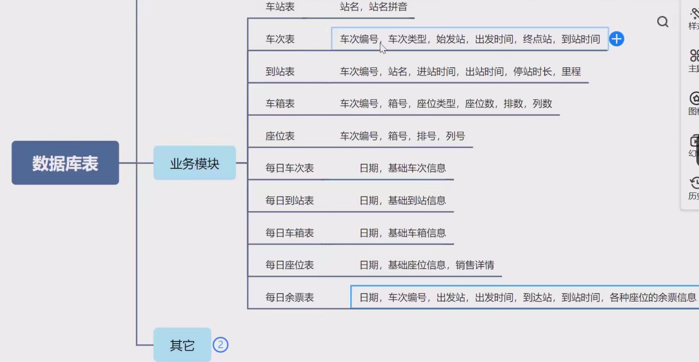

### 百万人抢一万张票，系统如何保证其正常及稳定性（持续秒杀高并发技术）

* 前端
  * 针对静态资源做CDN
  * 页面静态化
  * 倒计时&Loading
  * 使用验证码削峰
* 后端
  * 微服务-服务拆分
  * 负载均衡
  * 限流降级
  * 缓存
  * 令牌
  * 异步处理
* 数据库
  * 分库：业务分库、读写分离（将不同业务的表放在不同的数据库里，相互隔离）
  * 分表：横向分表、纵向分表
  * 冗余设计、反范式、空间换时间
  * 分布式数据库
* 其他
  * 分时段秒杀
  * 弹性扩容
  * 候补+排队

### 数据库表

1. **`station` 表**：存储车站的基本信息，包含车站的唯一标识、名称、拼音及新增和修改时间，车站名称具有唯一性。
2. **`train` 表**：记录车次的基本信息，如车次编号、类型、始发站、终点站、出发和到站时间等，车次编号具有唯一性。
3. **`train_station` 表**：存储火车车次经停站的详细信息，包括站序、站名、进站出站时间等，车次编号与站序、站名组合具有唯一性。
4. **`train_carriage` 表**：用于保存火车车厢的相关信息，如车次编号、厢号、座位类型、座位数等，车次编号与厢号组合具有唯一性。
5. **`train_seat` 表**：记录火车座位的基本信息，涵盖车次编号、厢序、排号、列号、座位类型等内容。
6. **`daily_train` 表**：存储每日车次的基本情况，包括日期、车次编号、始发站、终点站及时间等，日期和车次编号组合具有唯一性。
7. **`daily_train_station` 表**：记录每日火车车次经停站的信息，包含日期、车次编号、站序、站名等，日期、车次编号与站序、站名组合具有唯一性。
8. **`daily_train_carriage` 表**：保存每日火车车厢的相关信息，如日期、车次编号、厢序、座位类型等，日期、车次编号与厢序组合具有唯一性。
9. **`daily_train_seat` 表**：存储每日火车座位的基本信息和售卖情况，包含日期、车次编号、厢序、排号、列号等内容。
10. **`daily_train_ticket` 表**：记录每日车次的余票信息，包括日期、车次编号、出发站、到达站、各座位类型余票及票价等，日期、车次编号、出发站和到达站组合具有唯一性。
11. **`confirm_order` 表**：存储确认订单的信息，包含会员 ID、日期、车次编号、出发站、到达站、余票 ID、车票信息、订单状态等，有日期和车次编号的索引。
12. **`undo_log` 表**：用于存储分布式事务的回滚日志，包含全局事务 ID、分支事务 ID、上下文、回滚信息等，全局事务 ID 和分支事务 ID 组合具有唯一性。
13. **`sk_token` 表**：存储秒杀令牌的相关信息，如日期、车次编号、令牌余量等，日期和车次编号组合具有唯一性。
14. **`sk_token` 表**：记录秒杀令牌的信息，包含日期、车次编号和令牌余量，日期和车次编号组合唯一，同时记录新增和修改时间。

## 12306项目

项目分为多个子模块，包括member(会员)admin,business，common,batch,gateway,generator。
以下是12306中这些部分的简要介绍：

- **member（会员）**：用户注册成为会员，用于用户登录购票等，提升购票体验。
- **admin（管理员）**：负责系统全面管理，涵盖车次、票务、用户信息管理，系统参数设置、权限分配及监控维护等。
- **business（业务）**：包含车票预订、查询、支付、退票、改签等核心业务流程及相关规则制定与数据处理。
- **common（公共）**：提供公共资源、组件与功能，像代码库、工具类、配置文件、通用接口和数据字典，供多模块共享以提高复用性和可维护性。
- **batch（批处理）**：用于批量任务处理，如批量导入车次、更新票价、处理用户订单，提高数据处理效率，减少人工操作。
- **gateway（网关）**：作为系统与外部网络接口，负责接收转发用户请求，进行路由、过滤、鉴权，管理调度内部微服务，实现负载均衡等功能。
- **generator（生成器）**：按特定算法规则生成车票号码、订单编号、报表等数据或文件，保证系统数据准确规范。

### member模块

实现用户登录表的增删改查 （采用jwt登录方式）

### generator模块

根据freemarker自制前后端代码生成器，根据数据库表结构生成对应的实体类、Mapper、Service、Controller、req、enum、vue等代码，提高开发效率。

### batch模块

为12306项目增加定时调度，使用quartz框架实现定时任务，如每天凌晨更新车次信息、每周日清理过期订单等。

#### Quartz框架

* Job：表示一个具体的任务，是需要执行的工作单元。开发者需要定义自己的 Job 类，实现Job接口，在execute方法中编写具体的任务逻辑。
* Trigger：触发器，用于定义 Job 的执行计划，比如什么时候执行、执行的频率等。Quartz 提供了多种类型的 Trigger，如SimpleTrigger和CronTrigger。SimpleTrigger用于简单的定时任务，指定开始时间、结束时间和重复间隔等。CronTrigger则基于 Cron 表达式来定义更复杂的定时规则。
* Scheduler：调度器，是 Quartz 的核心，负责管理和调度 Job 与 Trigger。它充当了协调者的角色，将 Trigger 和 Job 关联起来，按照 Trigger 定义的时间规则来执行 Job。

#### 定时任务的实现

1. MyJobFactory和SchedulerConfig这两个类的主要作用是配置 Quartz 调度器，使其与 Spring 框架更好地集成，支持 Spring 的依赖注入功能，并使用数据库来持久化作业和触发器信息。
2. 定义了 JobController 的 Spring RESTful 控制器，用于管理 Quartz 定时任务。控制器通过不同的 HTTP 请求映射方法，提供了对定时任务的运行、添加、暂停、恢复、重新调度、删除和查询等操作。
3. 在前端界面，发起 HTTP 请求，调用后端的 RESTful API，实现对定时任务的管理。

### business模块

business模块属于管理后台，

* 完成了火车基础数据管理功能：车站、车次、车厢、座位（用户端只有查询，控台端有增删改查）
  * 基本数据（车站、车次、车厢、座位）的增删改查
  * 实现按车次生成座位功能（可以查询到每个车次的各个站点之间各类票的剩余情况，一等座的票数、硬卧、软卧的票数）
* 通过火车基础数据(自动、手动）生成每日火车数据
  * 增加每日车次数据维护功能: 车次、车站、车厢、座位
  * 增加定时任务：每天从车次基础数据生成每日车次数据（调用batch服务使用了openfeign)
* 余票查询功能：根据日期、车次、出发站、到达站查询各类车票（一等座、二等座、硬卧、软卧）的余票信息（用户端只有查询，控台端有增删改查）
* 选座功能：余票太少（<=30)不支持选座
* 主要是对订单的管理，包括订单的查询、删除、导出等功能
  座位表中的sell字段标识该座位在各个站点是否被售卖，售卖情况|将经过的车站用0表示可卖，1表示已卖
