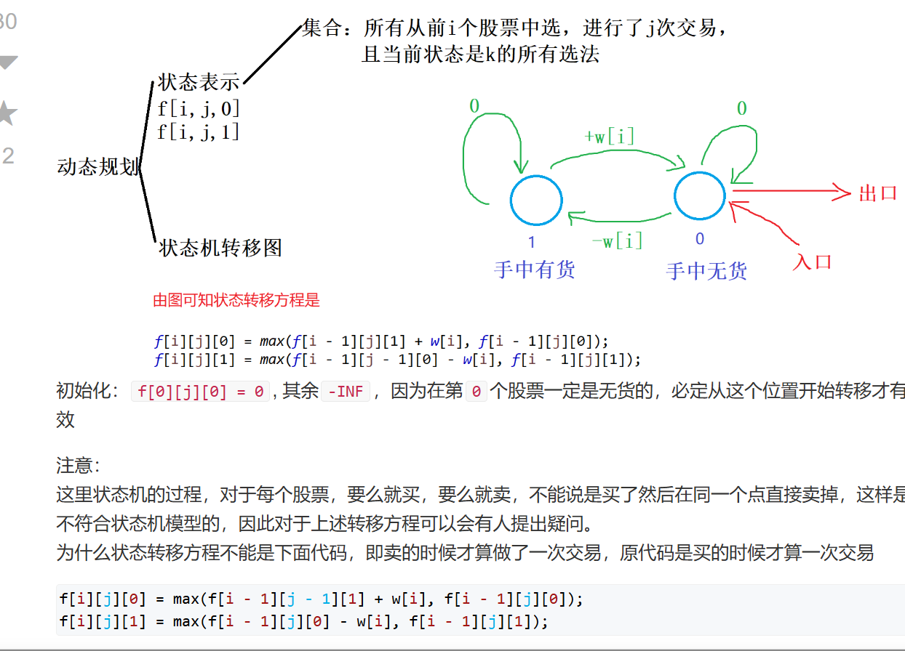
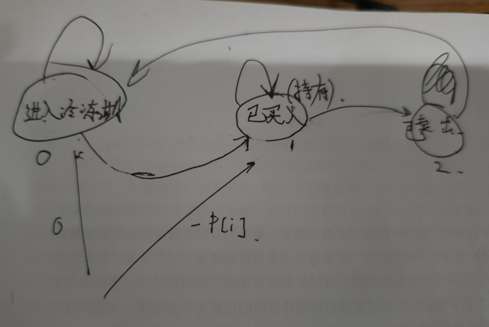

### 3. 爬楼梯[***](https://programmercarl.com/0070.%E7%88%AC%E6%A5%BC%E6%A2%AF.html)
```c++
class Solution {
public:
    int climbStairs(int n) {
        int a = 1, b = 1;
        for(int i = 0; i < n - 1; i++) {
            int t = a + b;
            a = b;
            b = t;
        }
        return b;
    }
};
```
```c++
class Solution {
public:
    int climbStairs(int n) {
      vector<int> f(n + 1);
      f[0] = 1, f[1] = 1;
      for(int i = 2; i <= n; i++) {
            f[i] = f[i - 1] + f[i - 2];
      }
      return f[n];
    }
};
```
### 4. 使用最小花费爬楼梯[***](https://programmercarl.com/0746.%E4%BD%BF%E7%94%A8%E6%9C%80%E5%B0%8F%E8%8A%B1%E8%B4%B9%E7%88%AC%E6%A5%BC%E6%A2%AF.html)
```c++
class Solution {
public:
    int minCostClimbingStairs(vector<int>& cost) {
        int n = cost.size();
        vector<int> f(n + 1);
        f[0] = f[1] = 0;
        for(int i = 2; i <= n; i++) {
            // 状态转移方程
            f[i] = min(f[i - 1] + cost[i - 1], f[i - 2] + cost[i - 2]);
        }
        return f[n];
    }
};
```

### 6.不同路径[***]()
```c++
class Solution {
public:
    int uniquePaths(int m, int n) {
        // f[i][j]  = f[i - 1][j] + f[i][j - 1]
        vector<vector<int>> f(m, vector<int>(n,0));
        f[0][0] = 1;
        for(int i = 0; i < m; i++)
        for(int j = 0; j < n; j++){
            if(i) f[i][j] += f[i - 1][j];
            if(j) f[i][j] += f[i][j - 1];
        }
        return f[m - 1][n - 1];
    }
};
```
### 7. 不同路径II[**](https://leetcode.cn/problems/unique-paths-ii/)
```c++
class Solution {
public:
    int uniquePaths(int m, int n) {
        // f[i][j]  = f[i - 1][j] + f[i][j - 1]
        vector<vector<int>> f(m, vector<int>(n,0));
        f[0][0] = 1;
        for(int i = 0; i < m; i++)
        for(int j = 0; j < n; j++){
            if(i) f[i][j] += f[i - 1][j];
            if(j) f[i][j] += f[i][j - 1];
        }
        return f[m - 1][n - 1];
    }
};
```

### 8. 整数拆分[***](https://leetcode.cn/problems/integer-break/)
```c++
class Solution {
public:
    int integerBreak(int n) { 
        vector<int> f(n + 1, 0);
        f[2] = 1;
        for(int i = 3; i <= n; i++)
        for(int j = 1; j <= i / 2; j++)
        // 把i拆分成(i -j) *j , f[i - j]*j
        // 其中f[i - j]表示i-j可以被拆分的乘积最大化
            f[i] = max(f[i], max((i - j) * j, f[i - j] * j));
        return f[n];
    }
};
```

### 9. 不同的二叉搜索树[***](https://leetcode.cn/problems/unique-binary-search-trees/)
```c++
class Solution {
public:
    int numTrees(int n) {
        vector<int> f(n + 1);
        f[0] = f[1] = 1;
        for(int i = 2; i <= n; i++)
        for(int j = 1; j <= i; j++) 
        // f[i]包含以1到i为根的各种情况，每种情况的种数是f[j - 1] * f[i - j]分别是左子树的个数俞右子树的节点个数笛卡尔积
            f[i] += f[j - 1] * f[i - j];
        return f[n];
    }
};
```

### 13. 分割等和子集[]()
```c++
class Solution {
public:
    bool canPartition(vector<int>& nums) {
        int n = nums.size(), m = 0; 
        for(auto x : nums) m += x;
        // 如果总和为奇数，无法对半分
        if(m % 2 == 1) return false;
        m /= 2;
        // 用nums数组元素装满容量为m的背包
        vector<int> f(m + 1);
        f[0] = 1;
        for(int i = 0; i < n; i++)
        for(int j = m; j >= nums[i]; j--)
            f[j] |= f[j - nums[i]];
        return f[m];
    }
};
```

### 14. 最后一块石头的重量II[***](https://leetcode.cn/problems/last-stone-weight-ii/)
```c++
class Solution {
public:
    int lastStoneWeightII(vector<int>& stones) {
        int n = stones.size(), m = 0;
        for(auto x : stones) m += x;
        int sum = m;
        m /= 2;
        vector<int> f(m + 1, 0);
        f[0] = 0;
        // 求出用stones数组装满sum/2的容量最大需要多少重量，重量和容量是一致的
        for(int i = 0; i < n; i++)
        for(int j = m; j >= stones[i]; j--)
            f[j] = max(f[j], f[j - stones[i]] + stones[i]);
        // 总和减去2倍的f[m]就是最后一块石头重量
        return sum - 2 * f[m];
    }
};
```
### 16. 目标和[***](https://leetcode.cn/problems/target-sum/description/)
```c++
class Solution {
public:
    int findTargetSumWays(vector<int>& nums, int target) {
        int sum = 0, n = nums.size();
        for(auto x : nums) sum += x;
        int dif = sum - target;
        if(dif < 0 || dif % 2 == 1) return 0;
        int m = dif / 2;
        // 准备两个背包，一个背包package_a存放标记为正的元素，另一个背包package_b存放标记为负的元素。package_a - package_b = target
        // 设nums的元素和为sum, 可以列出方程：

        // package_a - package_b = target;
        // package_a + package_b = sum;
        // package_a = (target + sum)/2
        vector<int> f(m + 1);
        f[0] = 1;
        for(int i = 0; i < n; i++)
        for(int j = m; j >= nums[i]; j--)
            f[j] += f[j - nums[i]];
        return f[m];
    }
};
```
### 17. 一和零[***]()
```c++
```

### 518. 零钱兑换II
```c++
class Solution {
public:
    int change(int amount, vector<int>& coins) {
        int n = coins.size();
        vector<unsigned int> f(amount + 1);
        int m = amount;
        f[0] = 1;
        for(int i = 0; i < n; i++) 
            for(int j = coins[i]; j <= m; j++)
                f[j] += f[j - coins[i]];
        return f[m];
    }
};
```

### 21. 组合综合IV
```c++
class Solution {
public:
    int combinationSum4(vector<int>& nums, int target) {
        int n = nums.size(), m = target;
        vector<unsigned> f(m + 1);
        f[0] = 1;
        // 外层是背包，内层是物体，表示顺序不同的序列视为不同的组合，是排列问题
        // 比如j=4, 有物品1和3，容量j在外层，会按照排列方式算两次
        for(int j = 1; j <= m; j++)
        for(int i = 0; i < n; i++)
            if(j >= nums[i]) 
                f[j] += f[j - nums[i]];
        return f[m];
    }
};
```

### 22. 爬楼梯(进阶版)[https://kamacoder.com/problempage.php?pid=1067]
```c++ 
#include<iostream>
#include<vector>
using namespace std;
const int N = 50;
int f[N];
int main()
{
    int n, m;
    cin >> n >> m;
    
    vector<int> f(n + 1, 0);
    f[0] = 1;
    // for(int i = 1; i <= m; i++)
    // for(int j = i; j <= n; j++)
    //     f[j] += f[j - i];
    /*此时，还要考虑同一种方案的排列顺序*/
    for(int j = 1; j <= n; j++)
    for(int i = 1; i <= m; i++)
    if(j >= i)
        f[j] += f[j - i];
    cout << f[n] << endl;
    return 0;
}
```
### 23. 零钱兑换[**](https://leetcode.cn/problems/coin-change/description/)
```c++
class Solution {
public:
    int coinChange(vector<int>& coins, int amount) {
        int n = coins.size(), m = amount;
        vector<int> f(m + 1,2e9);
        f[0] = 0;
        // 完全背包问题，硬币个数最少，初始化无穷大
        for(int i = 0; i < coins.size(); i++)
        for(int j = coins[i]; j <= m; j++)
            f[j] = min(f[j], f[j - coins[i]] + 1);
        if(f[m] > 1e9) return -1;
        return f[m];
    }
};
```
### 24. 完全平方数[***](https://leetcode.cn/problems/perfect-squares/)
```c++
class Solution {
public:
    int numSquares(int n) {
        vector<int> f(n + 1, 2e9);
        f[0] = 0;
        // 完全背包问题，用平方数装满n的最少数量，平放数是物品的体积
        for(int i = 1; i <= n / i; i++)
        for(int j = i * i; j <= n; j++)
            f[j] = min(f[j], f[j - i * i] + 1);
        if(f[n] >= 2e9) return 0;
        return f[n];
    }
};
```
### 26. 单词拆分[***](https://leetcode-cn.com/problems/word-break/)
* 如果求组合数就是外层for循环遍历物品，内层for遍历背包。
* 如果求排列数就是外层for遍历背包，内层for循环遍历物品。
```c++
class Solution {
public:
    bool wordBreak(string s, vector<string>& wordDict) {
        // 按照长度对wordDict排序
        unordered_set<string> wordSet(wordDict.begin(), wordDict.end());
        int n = s.size();
        vector<bool> f(n + 1);
        f[0] = true;
        // 背包容量在外，方便找子集
        for(int i = 1; i <= n; i++)
        for(int j = 0; j < i; j++) {
            string word = s.substr(j, i - j);
            // 如果[0, i]可以被拆分：那么[0, j]能被拆分且word在集合中
            if(wordSet.find(word) != wordSet.end() && f[j]) 
                f[i] = true;
        }
        return f[n];
    }
};
```
### 29. 打家劫舍[***]()
```c++
class Solution {
public:
    int rob(vector<int>& nums) {
        int n = nums.size();
        vector<int> f(n + 1), g(n + 1);
        f[0] = 0;
        g[0] = 0;
        for(int i = 1; i <= nums.size(); i++) {
            // 不偷窃第i个房屋，那么第i - 1个房屋可以偷窃也可以不偷窃
            g[i] = max(g[i - 1], f[i - 1]);
            // 偷窃第i个房屋，那么第i - 1个房屋一定不能偷窃
            f[i] = g[i - 1] + nums[i - 1];
        }
        // 选择偷窃最后一个和不偷窃最后一个的最大值
        return max(f[n], g[n]);
    }
};
```
### 30. 打家劫舍II[***](https://leetcode-cn.com/problems/house-robber-ii/)
```c++
class Solution {
public:
    int rob(vector<int>& nums) {
        int n = nums.size();
        if(n == 1) return nums[0];
        //可以将环在第1个位置分为两种情况，选择第一个，不选择第一个
        vector<int> f(n + 1), g(n + 1);
        //不选择第一个的情况
        int res = 0;
        for(int i = 2; i <= n; i++) {
            //选了第i个，不能选i-1
            f[i] = g[i - 1] + nums[i - 1];
            g[i] = max(f[i - 1], g[i - 1]);
        }
        //此时，可以选n，也可以不选n
        res = max(f[n], g[n]);
        f[1] = nums[0];
        //选了第1个，就不存在不选第1个的情况
        g[1] = INT_MIN;
          for(int i = 2; i <= n; i++) {
            f[i] = g[i - 1] + nums[i - 1];
            g[i] = max(f[i - 1], g[i - 1]);
        }
        //选了。第一个，第n个一定不能选，两者相邻
        res = max(res, g[n]);
        return res;
    }
};
``` 
###  31. 打家劫舍III[**](https://leetcode-cn.com/problems/house-robber-iii/)
```c++
/**
 * Definition for a binary tree node.
 * struct TreeNode {
 *     int val;
 *     TreeNode *left;
 *     TreeNode *right;
 *     TreeNode() : val(0), left(nullptr), right(nullptr) {}
 *     TreeNode(int x) : val(x), left(nullptr), right(nullptr) {}
 *     TreeNode(int x, TreeNode *left, TreeNode *right) : val(x), left(left), right(right) {}
 * };
 */
class Solution {
public:
    // dfs[0]是不选择root为根节点的子树最大利润，dfs[1]是选择root为根节点的子树最大利润
    vector<int> dfs(TreeNode *root) {
        if(!root) return {0, 0};
        auto left = dfs(root->left), right = dfs(root->right);
        return {max(left[0], left[1]) + max(right[0], right[1]), root->val + left[0] + right[0]};
    }
    int rob(TreeNode* root) {
        if(!root) return 0;
        auto t = dfs(root);
        return max(t[0], t[1]);
    }
};
```

### 32. 买卖股票的最佳时机[**](https://leetcode.cn/problems/best-time-to-buy-and-sell-stock/)
```c++
class Solution {
public:
    int maxProfit(vector<int>& prices) {
        int res = 0, tmp = prices[0];
        // 只能买一股
        for(int i = 1; i < prices.size(); i++) {
            // 计算最小进价
            tmp = min(tmp, prices[i]);
            // 找到当前售价-最小进价的最大差值（最大利润）
            res = max(res, prices[i] - tmp);
        }
        return  res;
    }
};
```

### 34. 买卖股票的最佳时机II[**](https://leetcode-cn.com/problems/best-time-to-buy-and-sell-stock-ii/)
```c++
class Solution {
public:
    int maxProfit(vector<int>& prices) {
        // 这里最大利润可以考虑用贪心的方法
        // [l, r]的最大利润划分成[l, l + 1], [l + 1, r] ... [r - 1, r]子区间的最大利润
        int sum = 0;
        for(int i = 1; i < prices.size(); i++) {
            if(prices[i] > prices[i - 1]) sum += prices[i] - prices[i - 1];
        }
        return sum;
    }
};
```

### 35. 买卖股票的最佳时机III[***](https://leetcode-cn.com/problems/best-time-to-buy-and-sell-stock-iii/)
```c++
class Solution {
public:
    int maxProfit(vector<int>& prices) {
        int n = prices.size();
        vector<int> f(n + 1), g(n + 1);
        // 两段式求解
        // 从前往后，找到每个节点的第一笔交易的最大利润
        //  f[i]表示前i天买卖第一支股票的最大利润
        int minp = prices[0];
        for(int i = 1; i < prices.size(); i++) {
            f[i] = max(f[i - 1], prices[i] - minp);
            minp = min(minp, prices[i]);
        }
        // g[i]表示第i天及以后的买卖第二支股票的最大利润
        int maxp = 0;
        // 两只股票买卖的最大值
        int res = 0;
        for(int i = prices.size() - 1; ~i; i--) {
            res = max(res, f[i] + maxp - prices[i]);
            maxp = max(maxp, prices[i]);
        }
        return res;
    }
};
```
### 36. 买卖股票的最佳时机IV[***](https://leetcode-cn.com/problems/best-time-to-buy-and-sell-stock-iv/)

```c++
class Solution {
public:
    /*
    第k笔交易可以看作状态机模型(k < n / 2)
    f[i][j]表示已走i条边，且已经交易了j次，手中无货的最大收益
    g[i][j]表示已走i条边，且正在进行第j次交易，手中有货的最大收益
    */
    int maxProfit(int k, vector<int>& prices) {
        int n = prices.size();
        if(k >= n / 2) {
            //等价为可以进行无限次交易
            int res = 0;
            for(int i = 0; i + 1< prices.size(); i++)
                if(prices[i] < prices[i + 1])
                    res += prices[i + 1] - prices[i];
            return res;
        }
        vector<vector<int>> f(2, vector<int>(k + 1, -1e9));
        auto g = f;
        f[0][0] = 0;
        int res = 0;
        for(int i = 1; i <= n; i++)
            for(int j = 0; j <= k;  j++) { 
                // 前i个第j次交易无货是由前i - 1第j次交易无货和前i-1第j次有货转移过来
                f[i & 1][j] = max(f[i - 1 & 1][j], g[i - 1 & 1][j] + prices[i - 1]);
                if(j == 0)  g[i & 1][j] = g[i - 1 & 1][j];
                // // 前i个第j次交易有货是由前i - 1第j次交易有货和前i-1第j-1次无货转移过来
                else g[i & 1][j] = max(g[i - 1 & 1][j], f[i - 1 & 1][j - 1] - prices[i - 1]);
                res = max(res, f[i & 1][j]);
            }
        return res;
    }
};
```

### 33. 最佳买卖股票时机含冷冻期[*](https://leetcode.cn/problems/best-time-to-buy-and-sell-stock-with-cooldown/description/)

```c++
class Solution {
public:
    int maxProfit(vector<int>& prices) {
        int n = prices.size();
        vector<vector<int>> f(n + 1, vector<int>(3, -2e9));
        // 入口，进入冷冻期，进入持有股票
        f[0][0] = 0, f[0][1] = -prices[0];
        for(int i = 1; i < n; i++) {
            // 冷冻期进入冷冻期，售完股票后进入冷冻期
            f[i][0] = max(f[i - 1][0], f[i - 1][2]);
            // 冷冻期到持有股票
            f[i][1] = max(f[i - 1][1], f[i - 1][0] - prices[i]);
            // 持有股票到售出
            f[i][2] = f[i - 1][1] + prices[i];
        }
        // 三者最大值
        return max(f[n - 1][0], max(f[n - 1][1], f[n - 1][2]));
    }
};
```

### 39. 买卖股票的最佳时机含手续费[**](https://leetcode.cn/problems/best-time-to-buy-and-sell-stock-with-transaction-fee/)
```c++
class Solution {
public:
    int maxProfit(vector<int>& prices, int fee) {
        int n = prices.size();
        vector<vector<int>> f(n + 1, vector<int>(2, -2e9));
        f[0][0] = 0;
        for(int i = 1; i <= n ; i++) {
            f[i][0] = max(f[i - 1][0], f[i - 1][1] + prices[i - 1]);
            f[i][1] = max(f[i - 1][1], f[i - 1][0] - prices[i - 1] - fee);
        }
        return max(f[n][0], f[n][1]);
    }
```

### 41. 最长上升子序列[**](https://leetcode.cn/problems/longest-increasing-subsequence/description/)
```c++
class Solution {
public:
    int lengthOfLIS(vector<int>& nums) {
        int n = nums.size();
        vector<int> f(n + 1);
        // f[i]表示以nums[i]为后缀的的递增序列的最大长度
        for(int i = 0; i < n; i++) {
            f[i] = 1;
            for(int j = 0; j < i; j++) 
                if(nums[j] < nums[i]) {
                    f[i] = max(f[i], f[j] + 1);
                }
        }
        int res = 0;
        for(int i = 0; i < n; i++)
            res = max(res, f[i]);
        return res;
    }
};
```
### 43. 最长重复子数组[**](https://leetcode.cn/problems/maximum-length-of-repeated-subarray/description/)
```c++
class Solution {
public:
    int findLength(vector<int>& nums1, vector<int>& nums2) {
        int n = nums1.size(), m = nums2.size();
        vector<vector<int>> f(n + 1, vector<int>(m + 1, 0));
        int res = 0;
        // f[i][j]表示为nums1[0~i-1] 和 nums2[0~j-1]的最长公共后缀
        for(int i = 1; i <= n; i++)
        for(int j = 1; j <= m; j++)
        {
            if(nums1[i - 1] == nums2[j - 1]) f[i][j] = f[i - 1][j - 1] + 1;
        //   找到所有情况下最长公共后缀
            res = max(res, f[i][j]);
        }
        return res;
    }
};
```

### 44. 最长公共子序列[**](https://leetcode.cn/problems/longest-common-subsequence/)
```c++
class Solution {
public:
    int longestCommonSubsequence(string text1, string text2) {
        int n = text1.size(), m = text2.size();
        vector<vector<int>> f(n + 1, vector<int>(m + 1, 0));
        int res = 0;
        // f[i][j]表示nums1的1~i和nums2的1~j的最长公共子序列
        // 包含四种情况，i在j在；i不在，j在；i在j不在；i和j都不在（这种情况已经被包含在第2，3情况中了）
        for(int i = 1; i <= n; i++)
        for(int j = 1; j <= m; j++) {
            if(text1[i - 1] == text2[j - 1]) f[i][j] = f[i - 1][j - 1] + 1;
            else {
                f[i][j] = max(f[i][j - 1], f[i - 1][j]);
            }
        }
        return f[n][m];
    }
};
```

### 45. 不相交的线[***](https://leetcode.cn/problems/uncrossed-lines/)
```c++
class Solution {
public:
    int maxUncrossedLines(vector<int>& nums1, vector<int>& nums2) {
        int n = nums1.size(), m = nums2.size();
        vector<vector<int>> f(n + 1, vector<int>(m + 1));
        for(int i = 1; i <= n; i++) 
        for(int j = 1; j <= m; j++) {
            if(nums1[i - 1] == nums2[j - 1]) f[i][j] = f[i - 1][j - 1] + 1;
            else {
                f[i][j] = max(f[i - 1][j], f[i][j - 1]);
            }
        }
        return f[n][m];
    }
};
```

### 46. 最大子序和[**](https://leetcode.cn/problems/maximum-subarray/description/)
```c++
class Solution {
public:
    int maxSubArray(vector<int>& nums) {
        // f[i]表示以第i个数结尾的连续子数组的最大和
        // f[i] = max(f[i - 1] + nums]i], nums[i]);
        int n = nums.size();
        // vector<int> f(n + 1);
        int sum = 0;
        int res = 0;
        for(int i = 1; i <= n; i++) {
            // f[i] = max(f[i - 1] + nums[i - 1], nums[i - 1]);
            sum  = max(sum + nums[i - 1], nums[i - 1]);
            // res = max(res, f[i]);
            res = max(res, sum);
        }
        return res;
    }
};
```

### 47. 判断子序列[**](https://leetcode.cn/problems/is-subsequence/)
```c++
class Solution {
public:
    bool isSubsequence(string s, string t) {
        int k = 0;
        for(auto x : t)
            if(x == s[k]) k++;
        return k == s.size();
    }
};
```

### 48. 不同的子序列[*](https://leetcode.cn/problems/distinct-subsequences/)
```c++
class Solution {
public:
    int numDistinct(string s, string t) {
        int n = s.size(), m = t.size();
        vector<vector<int>> f(n + 1, vector<int>(m + 1));
        // 初始化边界，选择s中空字符串与t中空字符串匹配
        for(int i = 0; i <= n; i++) f[i][0] = 1;
        // f[i][j]表示s中1~i的子序列在t中1~j子序列的出现次数
        int inf = 1e9 + 7;
        for(int i = 1; i <= n; i++)
        for(int j = 1; j <= m; j++) {
            // 不考虑s[i], 则取决于s中1~i-1的子序列在t中1~j子序列的出现次数
            f[i][j] = f[i - 1][j];
            // 考虑s[i]，s[[i]与s[j]匹配
            if(s[i - 1] == t[j - 1]) f[i][j] += f[i - 1][j - 1];
            f[i][j] %= inf;
        }
        return f[n][m];
    }
};
```
### 49. 两个字符串的删除操作[**](https://leetcode.cn/problems/delete-operation-for-two-strings/description/)
```c++
class Solution {
public:
    int minDistance(string word1, string word2) {
        int n = word1.size(), m = word2.size();
        vector<vector<int>> f(n + 1, vector<int>(m + 1, 0));
        for(int i = 0; i <= n; i++) f[i][0] = i;
        for(int i = 0; i <= m; i++) f[0][i] = i;
        // f[i][j]表示word1中  1~i字符串变成word2 的1~j字符串的最小操作次数
        for(int i = 1; i <= n; i++)
        for(int j = 1; j <= m; j++) {
            // 删除word1[i], word2[j]的情况
            f[i][j] = min(f[i - 1][j], f[i][j - 1]) + 1;
            if(word1[i - 1] == word2[j - 1]) f[i][j] = min(f[i][j], f[i - 1][j - 1]); 
        }
        return f[n][m];
    }
};
```
 
### 50.编辑距离[*](https://leetcode.cn/problems/edit-distance/description/)
```cpp
class Solution {
public:
    int minDistance(string a, string b) { 
        int n = a.size(), m = b.size();
        a = " " + a;
        b = " " + b;
        // f[i][j]表示将A[1~i]变成B[1~j]的按顺序最小操作次数
        vector<vector<int>> f(n + 1, vector<int>(m + 1));
        //将a的前i个变成0个，需要i步
        for(int i = 0; i <= n; i++) f[i][0] = i;
        for(int j = 0; j <= m; j++) f[0][j] = j;
        //f[i][j]是a的前i个变成b的前j个
        for(int i = 1; i <= n; i++)
        for(int j = 1; j <= m; j++) {
            //删除或插入, f[i-1][j]删除a中第i个或者b中插入第j+1个, f[i][j-1]:插入a中第i+1个或者b中删除第j个
            f[i][j] = min(f[i - 1][j], f[i][j - 1]) + 1;
            //如果a[i] == b[j]，则不需要修改，否则要修改一次
            int t = a[i] != b[j];
            f[i][j] = min(f[i][j], f[i - 1][j - 1] + t);
        }
        return f[n][m];
    }
};
```
### 52. 回文子串[**](https://leetcode.cn/problems/palindromic-substrings/)
```c++
class Solution {
public:
    int countSubstrings(string s) {
        int res = 0;
        for(int i = 0; i < s.size(); i++) {
            // 以i为中心位置，向左右两端扩展延申
            int j, k;
            // 枚举以i为中心的且奇数长度回文串
            for( j = i, k = i; j >= 0 && k < s.size(); j--, k++) {
                if(s[j] != s[k]) break;
                res++;
            } 
              // 枚举以i为中心的且偶数长度回文串
            for( j = i, k = i + 1; j >= 0 && k < s.size(); j--, k++) {
                if(s[j] != s[k]) break;
                res++;
            } 
        }
        return res;
    }
};
```
### 53. 最长回文子序列[*](https://leetcode.cn/problems/longest-palindromic-subsequence/)
```c++
class Solution {
public:
    int longestPalindromeSubseq(string s) {
        int n = s.size();
        vector<vector<int>>f(n + 1, vector<int>(n + 1));
        // f[i][j]表示s中i~j的字符串中最长回文子序列长度
        for(int len = 1; len <= n; len++)
        for(int i = 0; i < n && i + len - 1 < n; i++) {
            int j = i + len - 1;
            if(len == 1) f[i][j] = 1;
            else {
                // s[i]不在回文串中，s[j]不在回文串中两种情况
                 f[i][j] = max(f[i + 1][j], f[i][j - 1]);
                //  s[i]和s[j]都在回文串中
                if(s[i] == s[j]) f[i][j] = max(f[i][j], f[i + 1][j - 1] + 2); 
            }
        }
        return f[0][n - 1];
    }
};
```
### 9. 分割回文串[*](https://leetcode.cn/problems/palindrome-partitioning/submissions/599858137/)
```c++
class Solution {
public:
    int n;
    vector<vector<string>> v;
    void dfs(int u, vector<vector<bool>> &f, string s, vector<string> &res) {
        if(u == n) {
            v.push_back(res);
            return;
        }
        for(int i = u; i < n; i++)
            if(f[u][i]) {
                string t = s.substr(u, i - u + 1);
                res.push_back(t);
                dfs(i + 1, f, s, res);
                res.pop_back();
            }
    }
    vector<vector<string>> partition(string s) {
        n = s.size();
        vector<vector<bool>> f(n + 1, vector<bool>(n + 1));
        // 先通过动态规划找到所有的回文字串
        for(int i = 0; i < n; i++)   {
            int j, k;
            for(j = i, k = i; j >= 0 && k < n; j--, k++)
                if(s[j] != s[k]) break;
                else f[j][k] = true;

            for(j = i, k = i + 1; j >= 0 && k < n; j--, k++)
              {
                  if(s[j] != s[k]) break;
                else f[j][k] = true; 
              }
        }
        cout << f[0][1] << endl;
        vector<string> res;
        // 分段回溯找到s能够分割成回文串的所有方案
        dfs(0, f, s, res);
        return v;
    }
};
```

### 10. 复原地址[**](https://leetcode.cn/problems/restore-ip-addresses/submissions/599869386/)
```c++
class Solution {
public:
    int n;
    vector<string> v;
    void dfs(int u, vector<int> &res, string &s) {
        if(res.size() > 4) return;
        if(u == n) { 
            if(res.size() == 4) {
                string t;
                for(int i = 0; i < res.size(); i++) 
                    if(i < 3) t += to_string(res[i]) + ".";
                    else t += to_string(res[i]);
                v.push_back(t);
            }
            return;
        }
        for(int i = u, k = 0; i < n; i++) {   
            // 不能出现前导0，出现了的话，就退出
            if(s[u] == '0' && i - u >= 1) break;
            k = 10 * k + (s[i] - '0');
            if(k > 255) break; 
            res.push_back(k);
            dfs(i + 1, res, s);
            res.pop_back();  
        }
    }
    vector<string> restoreIpAddresses(string s) {
        n = s.size();
        vector<int> res;
        dfs(0, res, s);
        return v;
    }
};
```
### 11. 子集问题[***](https://leetcode.cn/problems/subsets/)
```c++
class Solution {
public:
    int n;
    vector<vector<int>> v;
    void dfs(vector<int>& nums, int u, int state) {
        if(u == n) {
            vector<int> res;
            for(int i = 0; i < n; i++)
                if(state >> i & 1) {
                    res.push_back(nums[i]);
                }
            v.push_back(res);
            return;
        }
        dfs(nums, u + 1, state);
        dfs(nums, u + 1, state | 1 << u); 
    }

    vector<vector<int>> subsets(vector<int>& nums) {
        n = nums.size();
        dfs(nums, 0, 0);
        return v;
    }
};
```
### 13. 子集II[**](https://leetcode.cn/problems/subsets-ii/)
```c++
class Solution {
public:
    vector<vector<int>> v;
    int n;
    void dfs(vector<int>& nums, int u, int state) {
        if(u == n) {
            vector<int> res;
            for(int i = 0; i < n; i++)
                if(state >> i & 1) 
                    res.push_back(nums[i]);
            v.push_back(res);
            return;
        }
        int k = u;
        // 找到有多少个相同的nums[u]；不选，选择1个，。。。选择K-U个
        while(k < n && nums[k] == nums[u]) k++;
        for(int i = 0; i <= k - u; i++) {
            dfs(nums, k, state);
            state |= 1 << (i + u);
        }
    }
    vector<vector<int>> subsetsWithDup(vector<int>& nums) {
        n = nums.size();
        // 去重，要按照从小到大排序
        sort(nums.begin(), nums.end());
        dfs(nums, 0, 0);
        return v;
    }
};
```
### 14. 递增子序列[]()
```c++
class Solution {
public:
 vector<vector<int>> v;
    int n; 
    void dfs(vector<int> &nums, int u, int last, int state) {
        if(u == n) {
            vector<int> res;
            for(int i = 0; i < n; i++)
                if(state >> i & 1) 
                    res.push_back(nums[i]);
            if(res.size() >= 2) v.push_back(res);
            return;
        }
        // 不选nums[u]
        if(nums[u] >= last) {
            dfs(nums, u + 1, nums[u], state | 1 << u);
        }
        // 选nums[u]
        if(nums[u] != last)
            dfs(nums, u + 1, last, state);
    }
    vector<vector<int>> findSubsequences(vector<int>& nums) {
         n = nums.size();
        // 去重，要按照从小到大排序 
        dfs(nums, 0, INT_MIN, 0);
        return v;
    }
};
```

### 15. 全排列[]()
```c++
class Solution {
public:
    int n;
    vector<vector<int>> v; 
    void dfs(vector<int>& nums, int u, int state, vector<int> &res) {
        if(u == n) { 
            v.push_back(res);
            return;
        }
        for(int i = 0; i < n; i++) 
            if(!(state >> i & 1)) 
            {
                res.push_back(nums[i]);
                dfs(nums, u + 1, state | 1 << i, res);
                res.pop_back();
            }
    }
    vector<vector<int>> permute(vector<int>& nums) {
        n = nums.size(); 
        vector<int> res;
        dfs(nums, 0, 0, res);
        return v;
    }
};
```

### 152. 乘积最大子数组[]()
```c++
class Solution {
public:
    int maxProduct(vector<int>& nums) {
        int n = nums.size();
        int f = nums[0], g = nums[0], res = nums[0];
        // f[i]是以nums[i]为后缀的最大乘积，g[i]是以nums[i]为后缀的最小乘积
        // 如果nums[i] > 0,则f[i] = f[i - 1] * nums[i], g[i] = g[i - 1] * nums[i]
        // 如果nums[i] < 0, 则f[i] = g[i - 1] * nums[i], g[i] = f[i - 1] * nums[i];
        for(int i = 1; i < n; i++) {
           int fa = f * nums[i], ga = g * nums[i];
        //   为了方便，我们直接取三者最大值，作为乘积最大
            f = max(nums[i], max(fa, ga));
            g = min(nums[i], min(fa, ga));
            res = max(f, res);
        }
        return res;
    }
};
```
### 32. 最长有效括号[**](https://leetcode.cn/problems/longest-valid-parentheses/?envType=study-plan-v2&envId=top-100-liked)
```c++
    class Solution {
    public:
        int longestValidParentheses(string s) {
            stack<int> stk;
            int res = 0, start = -1;
            for(int i = 0; i < s.size(); i++) {
                // 左括号添加到栈中
                if(s[i] == '(') stk.push(i);
                else {
                    // 栈不为空
                    if(stk.size()) {
                        // 弹出一个
                        stk.pop();
                        // 此时，stk.top存储的是上一个有效位置的点
                        if(stk.size()) {  
                            res = max(res, i - stk.top());
                        }
                        else 
                        // i  - 上一个无效位置的点
                            res = max(res, i - start);
                    }
                    else 
                    // start存储的是上一个无效的点
                        start = i;
                }
            }
            return res;
        }
    };
```