## 项目功能
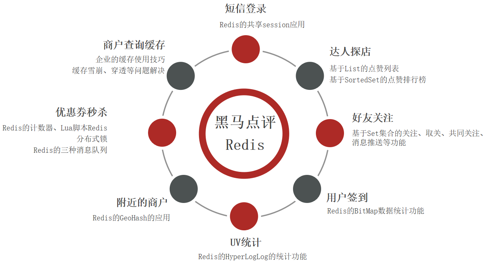
* 短信登录
* 商户查询缓存
* 优惠卷秒杀
* 达人探店
* 好友关注
* 附近的商户
* 用户签到
* UV统计
## 项目结构
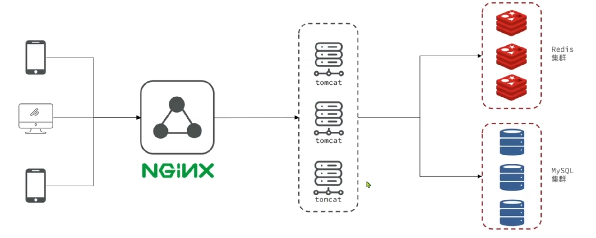
## 一、短信登录
### 1. 数据库的表
    tb_user：用户表
    tb_user_info：用户详情表
    tb_shop：商户信息表
    tb_shop_type：商户类型表
    tb_blog：用户日记表（达人探店日记）
    tb_follow：用户关注表
    tb_voucher：优惠券表
    tb_voucher_order：优惠券的订单表

### 2. session短信登录
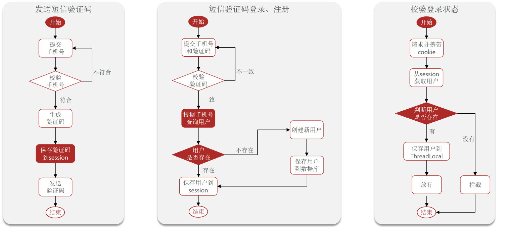
* session和cookie: 在 Web 应用中，通常需要跟踪用户的状态，比如用户是否登录、用户的购物车内容等。Cookie 常被用于存储用户的唯一标识（如session ID），而 Session 则基于这个session ID 来存储和管理与该用户相关的具体状态信息。当用户访问 Web 应用时，服务器生成一个唯一的 Session ID，并通过 Cookie 将其发送到用户的浏览器。此后，用户的后续请求都会携带这个 Cookie，服务器根据 Cookie 中的 Session ID 来查找对应的 Session，从而获取和更新用户的状态信息。  

* @RequestBody: 请求体中通常包含了要传递给服务器的数据，如 JSON、XML 格式的数据等。@RequestBody注解可以将这些数据自动转换为对应的 Java 对象，方便在服务器端进行处理。

#### 2.1 添加拦截器校验登录状态
校验登录状态信息功能放入前置拦截器中。  
threadlocal存储用户信息，方便后续使用。
```java
package com.hmdp.utils;

import com.hmdp.dto.UserDTO;

public class UserHolder {
    private static final ThreadLocal<UserDTO> tl = new ThreadLocal<>();

    public static void saveUser(UserDTO user){
        tl.set(user);
    }

    public static UserDTO getUser(){
        return tl.get();
    }

    public static void removeUser(){
        tl.remove();
    }
}
```
### 2.2 集群session的问题
    session共享问题： 多台Tomcat并不共享session存储空间，当请求切换到不同tomcat服务时导致数据丢失  
    解决方案应该满足：  
        * 数据共享
        * 内存存储
        * key, value结构
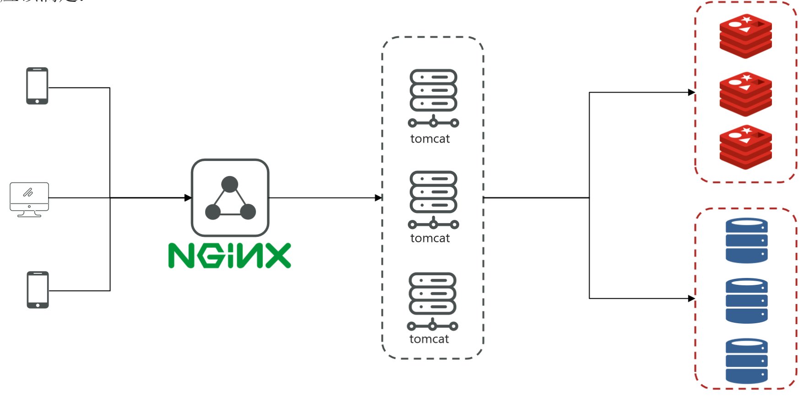

### 2.3 基于Redis实现共享登录
    key,value数据结构
    1. 保存登录的用户信息，可以用String结构，以Json字符串来保存，比较直观
    2. 也可以用Hash结构，可以将对象中的每个字段独立存储，可以针对单个字段做CRUD，并且内存更少、
1. 发送验证码和登录流程图
   登录使用的token不能使用手机号，因为我们要把token传给前端，会泄露安全信息；可以使用UUID生成token。

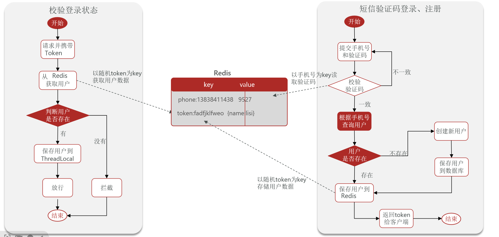

#### 2.3.1 发送验证码
使用stringRedisTemplate类的
```java
 public Result sendCode(String phone, HttpSession session) {
        // 1.校验手机号
        if (RegexUtils.isPhoneInvalid(phone)) {
            // 2.如果不符合，返回错误信息
            return Result.fail("手机号格式错误！");
        }
        // 3.符合，生成验证码
        String code = RandomUtil.randomNumbers(6);

        // 4.保存验证码到 redis
        stringRedisTemplate.opsForValue().set(LOGIN_CODE_KEY + phone, code, LOGIN_CODE_TTL, TimeUnit.MINUTES);

        // 5.发送验证码
        log.debug("发送短信验证码成功，验证码：{}", code);
        // 返回ok
        return Result.ok();
    }
```
### 2.3.2 用户登录
最后会返回一个登录令牌给用户给用户做登录
```java
public Result login(LoginFormDTO loginForm, HttpSession session) {
        // 1.校验手机号
        String phone = loginForm.getPhone();
        if (RegexUtils.isPhoneInvalid(phone)) {
            // 2.如果不符合，返回错误信息
            return Result.fail("手机号格式错误！");
        }
        // 3.从redis获取验证码并校验
        String cacheCode = stringRedisTemplate.opsForValue().get(LOGIN_CODE_KEY + phone);
        String code = loginForm.getCode();
        if (cacheCode == null || !cacheCode.equals(code)) {
            // 不一致，报错
            return Result.fail("验证码错误");
        }

        // 4.一致，根据手机号查询用户 select * from tb_user where phone = ?
        User user = query().eq("phone", phone).one();

        // 5.判断用户是否存在
        if (user == null) {
            // 6.不存在，创建新用户并保存
            user = createUserWithPhone(phone);

        }
        // 8.返回token
        return Result.ok(generateToken(user));
    }
```
```java
 public String generateToken(User user) {

        // 7.保存用户信息到 redis中
        // 7.1.随机生成token，作为登录令牌
        String token = UUID.randomUUID().toString(true);
        // 7.2.将User对象转为HashMap存储
        UserDTO userDTO = BeanUtil.copyProperties(user, UserDTO.class);
        Map<String, Object> userMap = BeanUtil.beanToMap(userDTO, new HashMap<>(),
                CopyOptions.create()
                        .setIgnoreNullValue(true)
                        .setFieldValueEditor((fieldName, fieldValue) -> fieldValue.toString()));
        // 7.3.存储
        String tokenKey = LOGIN_USER_KEY + token;
        stringRedisTemplate.opsForHash().putAll(tokenKey, userMap);
        // 7.4.设置token有效期
        stringRedisTemplate.expire(tokenKey, LOGIN_USER_TTL, TimeUnit.MINUTES);
        return token;
    }
```
#### 2.3.3 解决登录状态刷新的问题
    在登录校验时，要刷新token的有效期，保证用户在操作时不会因为登录状态失效而被踢出，只要用户一直在操作，token就不会失效。

#### 2.3.4 登录拦截器的优化
一个拦截，这种方法会拦截所有的请求，不管是否需要登录，这样会导致不需要登录的接口也会被拦截，进行登录校验。 
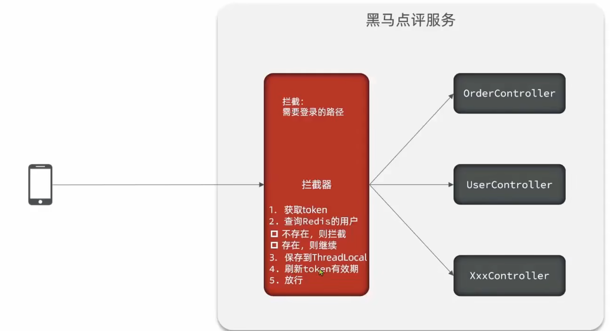
解决的问题： 对于不需要登录的接口，比如首页、商户详情，不需要做登录校验
解决方法： 使用两个拦截器进行拦截，第一个拦截器拦截一切路径，第二个拦截器对需要登录的路径拦截
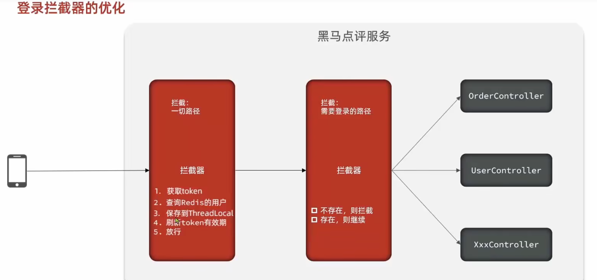

## 二、 缓存
给商户信息添加缓存
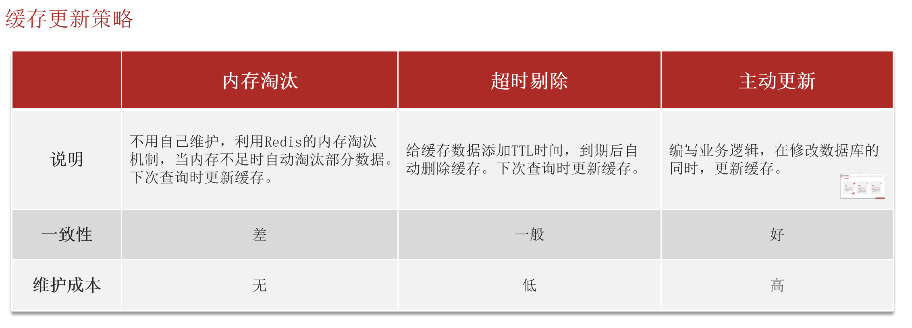
### 1.缓存更新策略
    1. 低一致性需求：使用内存淘汰机制，例如商铺类型的查询缓存
    2. 高一致性需求：主动更新，并以超时剔除作为兜底方案，例如店铺详情查询的缓存 
        * 读操作：
            缓存命中则直接返回
            缓存未命中则查询数据库，并写入缓存，设定超时时间
        * 写操作：
            先写数据库，然后再删除缓存
            要确保数据库与缓存操作的原子性

### 2. 实现商铺缓存与数据库的双写一致
案例：修改ShopController的业务逻辑，满足下面的需求
* 根据id查询店铺时，如果缓存未命中，则查询数据库，将数据库结果写入缓存，并设置超时时间（超时剔除）
* 根据id修改店铺时，先修改数据库，再删除缓存（主动更新）

### 3. 缓存穿透
### 4. 缓存击穿
### 5. 缓存雪崩

### 6. 封装redis工具类
    基于StringRedisTemplate封装一个缓存工具类，满足下列需求：
    方法1：将任意Java对象序列化为json并存储在string类型的key中，并且可以设置TTL过期时间
    方法2：将任意Java对象序列化为json并存储在string类型的key中，并且可以设置逻辑过期时间，用于处理缓存击穿问题
    方法3：根据指定的key查询缓存，并反序列化为指定类型，利用缓存空值的方式解决缓存穿透问题
    方法4：根据指定的key查询缓存，并反序列化为指定类型，需要利用逻辑过期解决缓存击穿问题

## 三、优惠券秒杀 
* 全局唯一ID
* 实现优惠卷秒杀下单
* 超卖问题
* 一人一单
* 分布式锁
* Redis优化秒杀
* Redis消息队列实现异步秒杀
### 1. 全局唯一ID
    tb_voucher_order: 优惠券订单表, 记录了下单的用户id、购买的代金卷id, 逐渐采用全局唯一ID，没有使用自增的方式 。
    id自增存在的问题：
    * id的规律性太明显，会被用户发现
    * 受单表数据量的限制（海量数据，千万级别，需要进行水平分表，此时采用自增策略，就会出现Id冲突）

    解决方法：全局ID生成器（Redis解决方案）全局ID生成器，是一种在分布式系统下用来生成全局唯一ID的工具，一般 要满足下列特性
    * 唯一性
    * 高可用
    * 高性能
    * 递增性
    * 安全性
  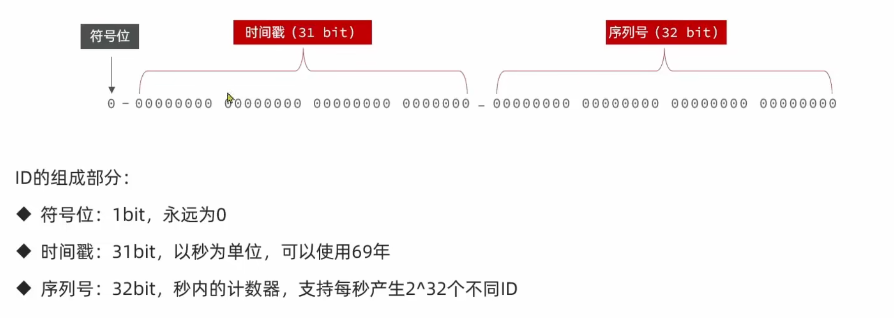
    用Redis的incr命令对序列号递增(StringRedisTemplate的opsForValue的increment方法），日期增长实现对时间戳的增长，保证了ID的唯一性和递增性。 

    全局唯一ID生成策略：
        UUID
        Redis自增
        snowflake算法
        数据库自增
    Redis自增ID策略：
        每天一个key，方便统计订单量
        ID构造是 时间戳 + 计数器
```java
 public long nextId(String prefixKey) {
        // 1.获取当前时间戳
        LocalDateTime now = LocalDateTime.now();
        long nowSecond = now.toEpochSecond(ZoneOffset.UTC);
        long nowTimeStamp = nowSecond - BEGIN_TIMESTAMP;
        // 2.获取序列号
        // 2.1获取当前日期，精确到天
        String data = now.format(DateTimeFormatter.ofPattern("yyyy:MM:dd"));
        // 2.2自增长
        long count = stringRedisTemplate.opsForValue().increment("inc:" + prefixKey + ":" + data);

        // 3.拼接返回,高位时间戳 低位序列号, 将时间戳向左移32位，低32位都为0，"|" 或运算填充低32位
        return nowTimeStamp << 32 | count;
    }
```
### 2. 实现优惠券秒杀下单
* tb_voucher: 优惠卷的基本信息，优惠金额、使用规则等
* tb_seckill_voucher: 优惠券的库存、开始抢购时间、结束抢购时间。(特价券才要填写这些信息)

    实现优惠券秒杀的下单功能：
        * 秒杀是否开始或结束，如果尚未开始或已经结束则无法下单
        * 库存是否充足，不足则无法下单
```java
 private void createVoucherOrder(VoucherOrder voucherOrder) {
        Long userId = voucherOrder.getUserId();
        Long voucherId = voucherOrder.getVoucherId();
        // 创建锁对象
        RLock redisLock = redissonClient.getLock("lock:order:" + userId);
        // 尝试获取锁
        boolean isLock = redisLock.tryLock();
        // 判断
        if (!isLock) {
            // 获取锁失败，直接返回失败或者重试
            log.error("不允许重复下单！");
            return;
        }

        try {
            // 5.1.查询订单
            int count = query().eq("user_id", userId).eq("voucher_id", voucherId).count();
            // 5.2.判断是否存在
            if (count > 0) {
                // 用户已经购买过了
                log.error("不允许重复下单！");
                return;
            }

            // 6.扣减库存
            boolean success = seckillVoucherService.update()
                    .setSql("stock = stock - 1") // set stock = stock - 1
                    .eq("voucher_id", voucherId).gt("stock", 0) // where id = ? and stock > 0
                    .update();
            if (!success) {
                // 扣减失败
                log.error("库存不足！");
                return;
            }

            // 7.创建订单
            save(voucherOrder);
        } finally {
            // 释放锁
            redisLock.unlock();
        }
    }
```

### 3. 超卖问题
真实场景下，成千上万个请求进行秒杀， 在高并发从场景下，库存出现超卖，会给商家带来巨大损失
解决超卖问题的方法是加锁
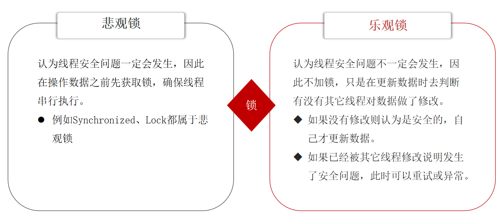
#### 3.1 乐观锁
乐观锁的关键是判断之前查询得到的数据是否有被修改过，常见的方式有两种：
1. 版本号法
2. CAS法
    扣减库存时会判断当前库存与刚刚查询到的库存是否一致，如果一致，才会扣减库存。这种方法会导致失败率大大增加。优化后，只需要在扣减库存时判断库存是否大于0即可。
```java
public Result seckillVoucherWithStockMysql(Long voucherId) {
        Voucher voucher = voucherMapper.selectById(voucherId);
        if (voucher == null) {
            return Result.fail("优惠券信息不存在");
        }
        // 优惠券使用时间信息
        SeckillVoucher seckillVoucher = seckillVoucherMapper.selectById(voucherId);
        LocalDateTime beginTime = seckillVoucher.getBeginTime();
        LocalDateTime endTime = seckillVoucher.getEndTime();

        if (beginTime.isAfter(LocalDateTime.now())) {
            return Result.fail("秒杀活动尚未开始！");
        }
        if (endTime.isBefore(LocalDateTime.now())) {
            return Result.fail("秒杀活动已结束！");
        }
        // 优惠券剩余库存数量
        Integer stock = seckillVoucher.getStock();
        if (stock <= 0) {
            return Result.fail("优惠券秒杀完毕库存不足！！！");
        }

        // 更新时判断是否库存是否大于0 乐观锁
        boolean success = seckillVoucherService.update().setSql(" stock = stock - 1").gt("stock", 0)
                .eq("voucher_id", voucherId).update();
        if (!success) {
            return Result.fail("优惠券秒杀完毕库存不足！！！");
        }

        VoucherOrder voucherOrder = new VoucherOrder();
        voucherOrder.setId(redisIdWorker2.nextId("order"));
        voucherOrder.setUserId(UserHolder.getUser().getId());
        voucherOrder.setVoucherId(voucherId);
        voucherOrder.setUpdateTime(LocalDateTime.now());
        save(voucherOrder);
        return Result.ok("抢购成功");
    }
```
### 3.2 悲观锁
    悲观锁：添加同步锁，让线程串行执行, 写多的场景， 用在插入操作比较合适
        优点：简单粗暴
        缺点：性能一般
    乐观锁：不加锁，在更新时判断是否有其它线程在修改, 读多写少的场景，用在更新操作比较合适
        优点：性能好
        缺点：存在成功率低的问题

### 4. 一人一单
    需求：修改秒杀业务，要求同一个优惠券，一个用户只能下一单 
        秒杀券目标时吸引更多的用户参与进来，避免黄牛抢购，所以要求一个用户只能下一单
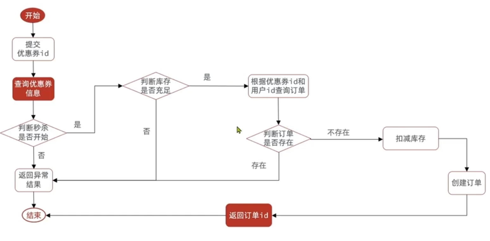

    * 业务中涉及到查插入数据，在插入数据前，我们要添加悲观锁。
    * 如果在事务内部加锁，锁释放了，但是事务可能没有提交，仍然存在并发安全问题 
    
    * Spring 的事务管理是基于 AOP（面向切面编程）实现的。AOP 通过代理对象来维护事务的生命周期，包括事务的开启、提交或回滚。如果直接使用目标对象，spring将无法在方法调用前后执行必要的事务管理操作，因为它依赖于代理机制进行事务管理。解决方法是获取事务的代理对象，通过代理对象去调用事务方法。
```java
@Override
    public Result seckillVoucherByUser(Long voucherId) {
        Voucher voucher = voucherMapper.selectById(voucherId);
        if (voucher == null) {
            return Result.fail("优惠券信息不存在");
        }
        // 优惠券使用时间信息
        SeckillVoucher seckillVoucher = seckillVoucherMapper.selectById(voucherId);
        LocalDateTime beginTime = seckillVoucher.getBeginTime();
        LocalDateTime endTime = seckillVoucher.getEndTime();

        if (beginTime.isAfter(LocalDateTime.now())) {
            return Result.fail("秒杀活动尚未开始！");
        }
        if (endTime.isBefore(LocalDateTime.now())) {
            return Result.fail("秒杀活动已结束！");
        }
        // 优惠券剩余库存数量
        Integer stock = seckillVoucher.getStock();
        if (stock <= 0) {
            return Result.fail("优惠券秒杀完毕库存不足！！！");
        }
        // 获取代理对象
        IVoucherOrderService iVoucherOrderService = (IVoucherOrderService) AopContext.currentProxy();
        // 根据userId加锁，不同用户不会被锁定，userId.toString()方法中会每次都会产生不同的userId，所以起不到锁定作用，intern()会从jvm中的常量池中去匹配userId
        // 不将synchronized加在createVoucherOrder()方法上是因为锁粒度变大，锁的对象为this，多线程执行方法为串行执行，效率低，对userId加锁是相当对每一个用户进行加锁处理，锁粒度变小
        Long userId = UserHolder.getUser().getId();
        synchronized (userId.toString().intern()) {
            return iVoucherOrderService.createVoucherOrder(voucherId);
        }
    }

    @Transactional
    public Result createVoucherOrder(Long voucherId) {
        // 5.一人一单
        Long userId = UserHolder.getUser().getId();

        // 创建锁对象
        SimpleRedisLock redisLock = new SimpleRedisLock("order:" + userId, stringRedisTemplate);
        // 尝试获取锁
        boolean isLock = redisLock.tryLock(1200);
        // 判断
        if(!isLock){
            // 获取锁失败，直接返回失败或者重试
            return Result.fail("不允许重复下单！");
        }

        try {
            // 5.1.查询订单
            int count = query().eq("user_id", userId).eq("voucher_id", voucherId).count();
            // 5.2.判断是否存在
            if (count > 0) {
                // 用户已经购买过了
                return Result.fail("用户已经购买过一次！");
            }

            // 6.扣减库存
            boolean success = seckillVoucherService.update()
                    .setSql("stock = stock - 1") // set stock = stock - 1
                    .eq("voucher_id", voucherId).gt("stock", 0) // where id = ? and stock > 0
                    .update();
            if (!success) {
                // 扣减失败
                return Result.fail("库存不足！");
            }

            // 7.创建订单
            VoucherOrder voucherOrder = new VoucherOrder();
            // 7.1.订单id
            long orderId = redisIdWorker.nextId("order");
            voucherOrder.setId(orderId);
            // 7.2.用户id
            voucherOrder.setUserId(userId);
            // 7.3.代金券id
            voucherOrder.setVoucherId(voucherId);
            save(voucherOrder);

            // 7.返回订单id
            return Result.ok(orderId);
        } finally {
            // 释放锁
            redisLock.unlock();
        } 
    }
```
局限性:只适合单机场景

### 5. 分布式锁
分布式锁：满足分布式系统或集群模式下多进程可见并且互斥的锁
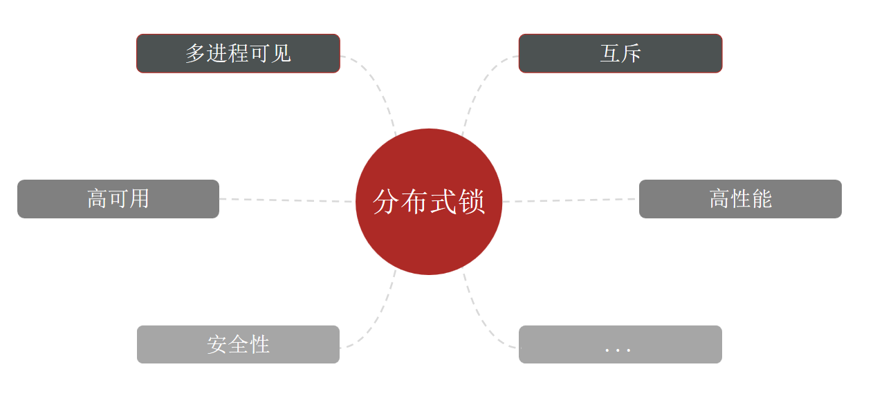
#### 5.1 基于Redis的分布式锁（基于setnx的分布式锁 ）
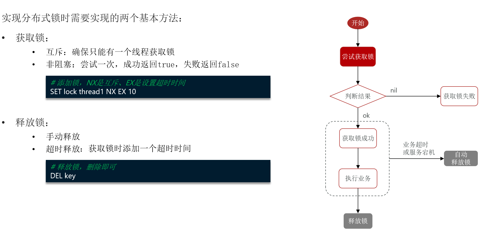
```java
public class SimpleRedisLock2 implements ILock {

    private StringRedisTemplate stringRedisTemplate;
    private String name;
    private static final String PRE_LOCK = "lock:";

    private String getLockName() {
        return PRE_LOCK + name;
    }

    public SimpleRedisLock2(StringRedisTemplate stringRedisTemplate, String name) {
        this.stringRedisTemplate = stringRedisTemplate;
        this.name = name;
    }

    @Override
    public boolean tryLock(long timeoutSec) {
        // 将线程ID当做value存入redis
        long threadId = Thread.currentThread().getId();
        Boolean absent = stringRedisTemplate.opsForValue().setIfAbsent(getLockName(), String.valueOf(threadId), timeoutSec, TimeUnit.SECONDS);
        return Boolean.TRUE.equals(absent);
    }

    @Override
    public void unlock() {
        stringRedisTemplate.delete(getLockName());
    }
}
```
    存在的问题：
    线程1获取到锁后，因为业务阻塞，阻塞时间过长导致锁超时提前释放了，线程2就获取到锁了执行业务，假如此时线程1业务结束，释放锁，结果把线程2的锁给释放了。

#### 5.2 改进Redis的分布式锁
    需求： 修改之前的分布式锁实现，满足：
    1. 在获取锁时存入线程标识（可以用UUID表示）
        在分布式系统中，不同的机器上可能会出现相同的线程id，因此要用UUID让分布式系统中的所有元素都能有唯一的辨识信息
    2. 在释放锁时先获取锁中的线程标识，判断是否与当前线程标识一致
       1. 如果一致则释放锁
       2. 如果不一致则不释放锁
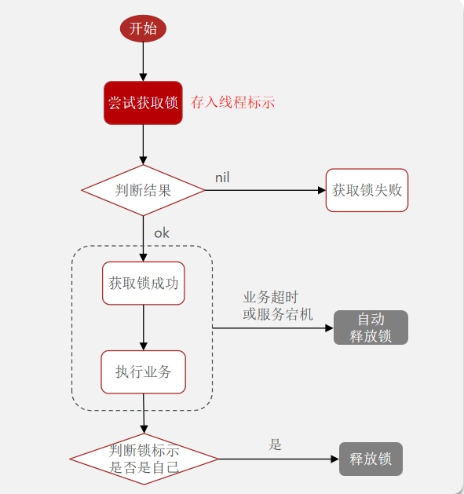

    仍然存在问题，判断锁的标识和释放锁时两个操作，必须捆绑成一个原子操作，不会出错。
    解决方法： 使用lua脚本实现锁的标识和释放锁原子性功能

#### 5.4 lua脚本
    lua脚本帮助你实现复杂的逻辑并保证操作的原子性。当执行 Lua 脚本时，Redis 会将整个脚本作为一个原子操作执行，即脚本在执行过程中不会被其他客户端的命令打断，从而避免了并发问题，保证了操作的原子性。
    用StringRedisTemplate的execute命令去执行Lua脚本
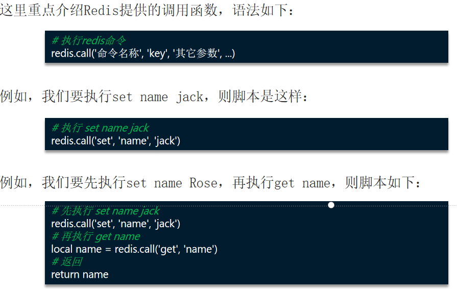

```lua
-- 比较线程标示与锁中的标示是否一致
if(redis.call('get', KEYS[1]) ==  ARGV[1]) then
    -- 释放锁 del key
    return redis.call('del', KEYS[1])
end
return 0
```
```java
public class SimpleRedisLock implements ILock {

    private String name;
    private StringRedisTemplate stringRedisTemplate;

    public SimpleRedisLock(String name, StringRedisTemplate stringRedisTemplate) {
        this.name = name;
        this.stringRedisTemplate = stringRedisTemplate;
    }

    private static final String KEY_PREFIX = "lock:";
    private static final String ID_PREFIX = UUID.randomUUID().toString(true) + "-";
    private static final DefaultRedisScript<Long> UNLOCK_SCRIPT;
    static {
        UNLOCK_SCRIPT = new DefaultRedisScript<>();
        UNLOCK_SCRIPT.setLocation(new ClassPathResource("unlock.lua"));
        UNLOCK_SCRIPT.setResultType(Long.class);
    }

    @Override
    public boolean tryLock(long timeoutSec) {
        // 获取线程标示
        String threadId = ID_PREFIX + Thread.currentThread().getId();
        // 获取锁
        Boolean success = stringRedisTemplate.opsForValue()
                .setIfAbsent(KEY_PREFIX + name, threadId, timeoutSec, TimeUnit.SECONDS);
        return Boolean.TRUE.equals(success);
    }

    @Override
    public void unlock() {
        // 调用lua脚本
        stringRedisTemplate.execute(
                UNLOCK_SCRIPT,
                Collections.singletonList(KEY_PREFIX + name),
                ID_PREFIX + Thread.currentThread().getId());
    }
}
```
基于setnx实现的分布式锁存在下面的问题
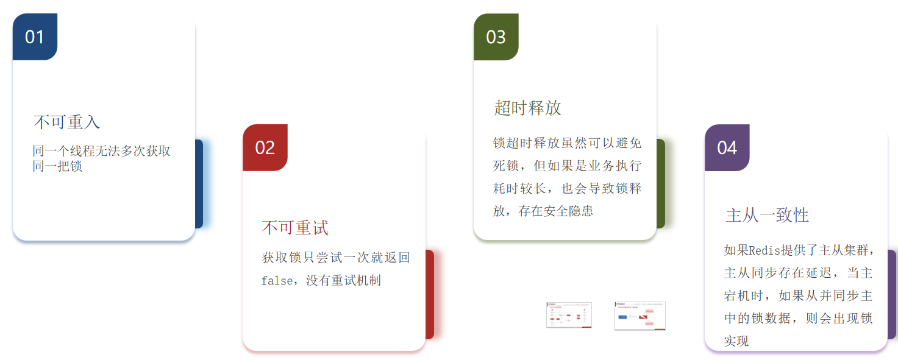

### 6. Redission
Redisson是一个在Redis的基础上实现的Java驻内存数据网格（In-Memory Data Grid）。它不仅提供了一系列的分布式的Java常用对象，还提供了许多分布式服务，其中就包含了各种分布式锁的实现。

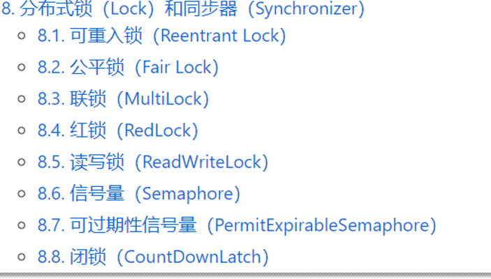
```java 
    void method1() throws InterruptedException {
        // 尝试获取锁
        boolean isLock = lock.tryLock(1L, TimeUnit.SECONDS);
        if (!isLock) {
            log.error("获取锁失败 .... 1");
            return;
        }
        try {
            log.info("获取锁成功 .... 1");
            method2();
            log.info("开始执行业务 ... 1");
        } finally {
            log.warn("准备释放锁 .... 1");
            lock.unlock();
        }
    }
```
#### 6.1 Redission的可重入锁原理
可重入锁是 Redisson 最常用的锁类型，同一线程可以多次获取同一把锁而不会被阻塞。以下是加锁的详细步骤：
   1. 发送 Lua 脚本：Redisson 使用 Lua 脚本来保证加锁操作的原子性。当线程尝试获取锁时，会向 Redis 发送如下 Lua 脚本：
   2. 判断锁是否存在：脚本首先检查锁的键是否存在。如果不存在，则使用 hincrby 命令创建一个哈希表，将线程的唯一标识作为字段，值初始化为 1，并设置过期时间。这表示该线程成功获取到锁。
   3. 判断是否为同一线程重入：如果锁的键已经存在，脚本会检查哈希表中是否存在当前线程的唯一标识。如果存在，则将该字段的值加 1，并更新过期时间。这实现了锁的可重入性。
   4. 返回结果：如果加锁成功，脚本返回 nil；如果锁已经被其他线程持有，脚本返回锁的剩余过期时间。
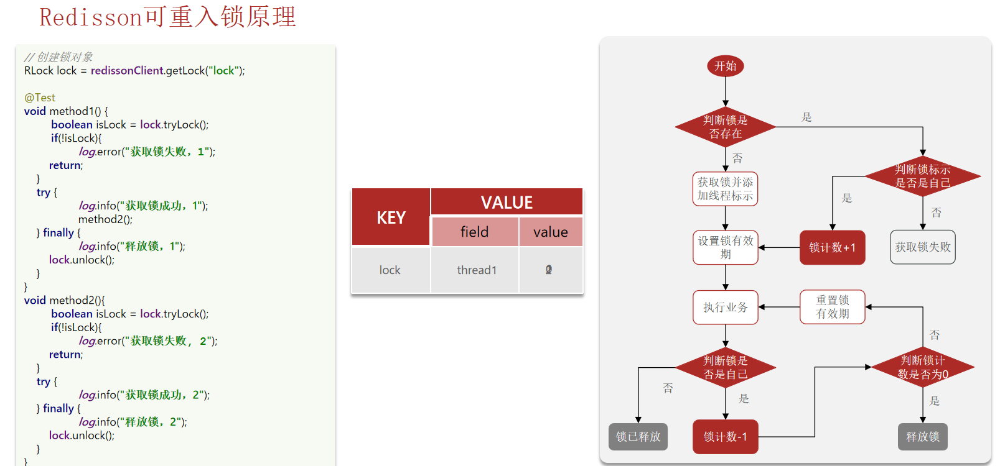

### 6.2 锁的可重试
    利用信号量和PubSub功能实现等待、唤醒，获取锁失败的重试机制
PubSub（发布 - 订阅）：Redis 的 PubSub 功能允许客户端订阅特定的频道，并在其他客户端向该频道发布消息时接收通知。在锁重试机制中，当持有锁的线程释放锁时，会向特定的频道发布消息，等待的线程订阅该频道，接收到消息后会尝试重新获取锁。

### 6.3 锁的自动续期（看门狗机制）
为了防止业务逻辑执行时间过长导致锁过期提前释放，Redisson 引入了看门狗机制。当一个线程成功获取到锁后，Redisson 会启动一个定时任务，每隔一段时间（默认是锁过期时间的 1/3）检查锁是否还存在，如果存在则自动延长锁的过期时间。

### 6.4 Redission的multilocak
    解决分布式锁主从一致性问题
Redlock 算法的核心思想是不依赖于单个 Redis 实例或主从复制，而是基于多个独立的 Redis 节点。在获取锁时，需要在大多数（超过一半）的 Redis 节点上成功获取到锁，才认为锁获取成功；释放锁时，需要在所有参与的 Redis 节点上释放锁。这样即使某个节点发生故障，只要大多数节点正常，锁的状态依然可以得到保证。
 

### 7. Redis优化秒杀
优化前
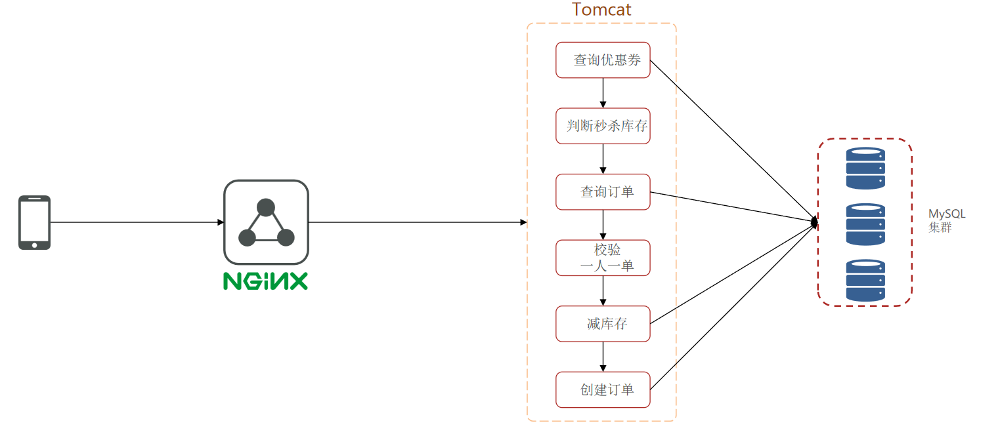
优化后: 将优惠券库存和优惠券订单放入redis缓存中， 异步秒杀， 吞吐量从420~1100
一方面缩短了业务流程，另一方面减轻了数据库的压力
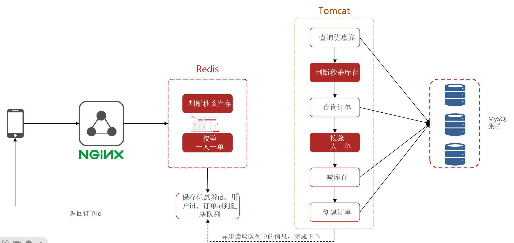
**优化思路**
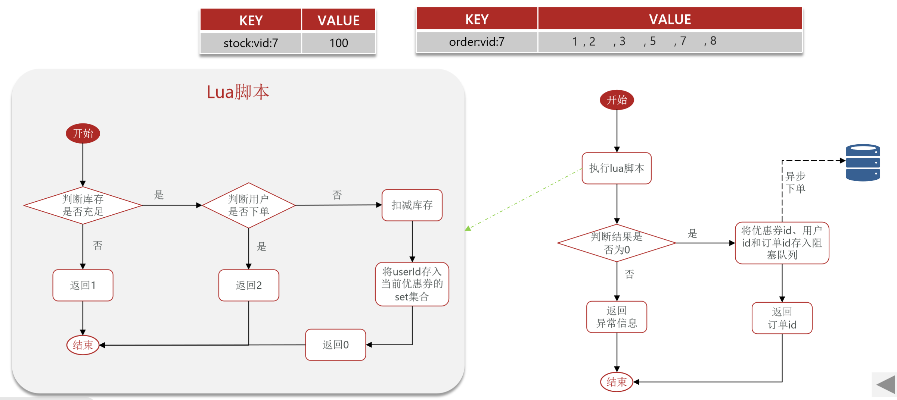
案例需求：
    1. 新增秒杀优惠券的同时，将优惠券信息保存到Redis中  
    2. 基于Lua脚本，判断秒杀库存、一人一单，决定用户是否抢购成功  
    3. 如果抢购成功，将优惠券id和用户id封装后存入阻塞队列  
    4. 开启线程任务，不断从阻塞队列中获取信息，实现异步下单功能  
1. 
```java
// 保存优惠券信息到redis中
@Transactional
    public void addSeckillVoucher(Voucher voucher) {
        // 保存优惠券
        save(voucher);
        // 保存秒杀信息
        SeckillVoucher seckillVoucher = new SeckillVoucher();
        seckillVoucher.setVoucherId(voucher.getId());
        seckillVoucher.setStock(voucher.getStock());
        seckillVoucher.setBeginTime(voucher.getBeginTime());
        seckillVoucher.setEndTime(voucher.getEndTime());
        seckillVoucherService.save(seckillVoucher);
        // 保存秒杀库存到Redis中
        stringRedisTemplate.opsForValue().set(SECKILL_STOCK_KEY + voucher.getId(), voucher.getStock().toString());
    }
```
2. lua脚本
```lua
-- 1.参数列表
-- 1.1.优惠券id
local voucherId = ARGV[1]
-- 1.2.用户id
local userId = ARGV[2]
-- 1.3.订单id
local orderId = ARGV[3]

-- 2.数据key
-- 2.1.库存key
local stockKey = 'seckill:stock:' .. voucherId
-- 2.2.订单key
local orderKey = 'seckill:order:' .. voucherId

-- 3.脚本业务
-- 3.1.判断库存是否充足 get stockKey
if(tonumber(redis.call('get', stockKey)) <= 0) then
    -- 3.2.库存不足，返回1
    return 1
end
-- 3.2.判断用户是否下单 SISMEMBER orderKey userId
if(redis.call('sismember', orderKey, userId) == 1) then
    -- 3.3.存在，说明是重复下单，返回2
    return 2
end
-- 3.4.扣库存 incrby stockKey -1
redis.call('incrby', stockKey, -1)
-- 3.5.下单（保存用户）sadd orderKey userId
redis.call('sadd', orderKey, userId)
-- 3.6.发送消息到队列中， XADD stream.orders * k1 v1 k2 v2 ...
redis.call('xadd', 'stream.orders', '*', 'userId', userId, 'voucherId', voucherId, 'id', orderId)
return 0
```
java代码，执行lua脚本
```java
 @Override
    public Result seckillVoucher(Long voucherId) {
        Long userId = UserHolder.getUser().getId();
        long orderId = redisIdWorker.nextId("order");
        // 1.执行lua脚本
        Long result = stringRedisTemplate.execute(
                SECKILL_SCRIPT,
                Collections.emptyList(),
                voucherId.toString(), userId.toString(), String.valueOf(orderId)
        );
        int r = result.intValue();
        // 2.判断结果是否为0
        if (r != 0) {
            // 2.1.不为0 ，代表没有购买资格
            return Result.fail(r == 1 ? "库存不足" : "不能重复下单");
        }
        // 结果为0
        // TODO 保存到阻塞队列中
        // 3.返回订单id
        return Result.ok(orderId);
    }
```
秒杀业务的优化思路是什么？
   * 先利用Redis完成库存余量、一人一单判断，完成抢单业务  
   * 再将下单业务放入阻塞队列，利用独立线程异步下单  
基于阻塞队列的异步秒杀存在哪些问题？  
    * 内存限制问题  
    * 数据安全问题

### 8. Redis消息队列实现异步秒杀
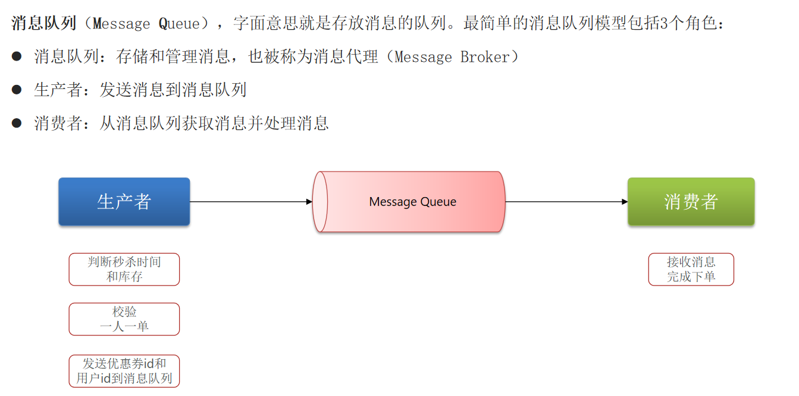  

#### 8.1 实现消息队列的三种方式
1. list结构：基于List结构模拟消息队列
    LPUSH 结合 RPOP、或者 RPUSH 结合 LPOP来实现。注意的是，当队列中没有消息时RPOP或LPOP操作会返回null，并不像JVM的阻塞队列那样会阻塞并等待消息。因此这里应该使用BRPOP或者BLPOP来实现阻塞效果。  
    优点：
        利用Redis存储，不受限于JVM内存上限
        基于Redis的持久化机制，数据安全性有保证
        可以满足消息有序性  
    缺点：
        无法避免消息丢失  
        只支持单消费者  

2. PubSub：基本的点对点消息模型
 
    优点：
        采用发布订阅模型，支持多生产、多消费  
    缺点：  
    *  不支持数据持久化  
    *  无法避免消息丢失  
    * 消息堆积有上限，超出时数据丢失  
  、
 
1. Stream：比较完善的消息队列模型
a. stream的单消费模式
* 消息可回溯
* 一个消息可以被多个消费者读取
* 可以阻塞读取
* 有消息漏读的风险

b. stream的消费组模式
* 消息可回溯
* 可以多消费者争抢消息，加快消费速度
* 可以阻塞读取
* 没有消息漏读的风险
* 有消息确认机制，保证消息至少被消费一次
#### 8.2 基于Redis的Stream结构作为消息队列，实现异步秒杀下单
需求：
    1. 创建一个Stream类型的消息队列，名为stream.orders
    2. 修改之前的秒杀下单Lua脚本，在认定有抢单资格后，直接向stream.orders添加消息，内容包含voucherId、userId、orderId
    3. 项目启动时，开启一个线程任务，尝试获取stream.orders中消息，完成下单
1. lua脚本  
```lua
-- 1.参数列表
-- 1.1.优惠券id
local voucherId = ARGV[1]
-- 1.2.用户id
local userId = ARGV[2]
-- 1.3.订单id
local orderId = ARGV[3]

-- 2.数据key
-- 2.1.库存key
local stockKey = 'seckill:stock:' .. voucherId
-- 2.2.订单key
local orderKey = 'seckill:order:' .. voucherId

-- 3.脚本业务
-- 3.1.判断库存是否充足 get stockKey
if(tonumber(redis.call('get', stockKey)) <= 0) then
    -- 3.2.库存不足，返回1
    return 1
end
-- 3.2.判断用户是否下单 SISMEMBER orderKey userId
if(redis.call('sismember', orderKey, userId) == 1) then
    -- 3.3.存在，说明是重复下单，返回2
    return 2
end
-- 3.4.扣库存 incrby stockKey -1
redis.call('incrby', stockKey, -1)
-- 3.5.下单（保存用户）sadd orderKey userId
redis.call('sadd', orderKey, userId)
-- 3.6.发送消息到队列中， XADD stream.orders * k1 v1 k2 v2 ...
redis.call('xadd', 'stream.orders', '*', 'userId', userId, 'voucherId', voucherId, 'id', orderId)
return 0
```

消费者代码
```java
 public void run() {
           while (true) {
               try {
                   // 1.获取消息队列中的订单信息 XREADGROUP GROUP g1 c1 COUNT 1 BLOCK 2000 STREAMS s1 >
                   List<MapRecord<String, Object, Object>> list = stringRedisTemplate.opsForStream().read(
                           Consumer.from("g1", "c1"),
                           StreamReadOptions.empty().count(1).block(Duration.ofSeconds(2)),
                           StreamOffset.create("stream.orders", ReadOffset.lastConsumed())
                   );
                   // 2.判断订单信息是否为空
                   if (list == null || list.isEmpty()) {
                       // 如果为null，说明没有消息，继续下一次循环
                       continue;
                   }
                   // 解析数据
                   MapRecord<String, Object, Object> record = list.get(0);
                   Map<Object, Object> value = record.getValue();
                   VoucherOrder voucherOrder = BeanUtil.fillBeanWithMap(value, new VoucherOrder(), true);
                   // 3.创建订单
                   createVoucherOrder(voucherOrder);
                   // 4.确认消息 XACK
                   stringRedisTemplate.opsForStream().acknowledge("s1", "g1", record.getId());
               } catch (Exception e) {
                   log.error("处理订单异常", e);
                   handlePendingList();
               }
           }
       }

  private void handlePendingList() {
            while (true) {
                try {
                    // 1.获取pending-list中的订单信息 XREADGROUP GROUP g1 c1 COUNT 1 BLOCK 2000 STREAMS s1 0
                    List<MapRecord<String, Object, Object>> list = stringRedisTemplate.opsForStream().read(
                            Consumer.from("g1", "c1"),
                            StreamReadOptions.empty().count(1),
                            StreamOffset.create("stream.orders", ReadOffset.from("0"))
                    );
                    // 2.判断订单信息是否为空
                    if (list == null || list.isEmpty()) {
                        // 如果为null，说明没有异常消息，结束循环
                        break;
                    }
                    // 解析数据
                    MapRecord<String, Object, Object> record = list.get(0);
                    Map<Object, Object> value = record.getValue();
                    VoucherOrder voucherOrder = BeanUtil.fillBeanWithMap(value, new VoucherOrder(), true);
                    // 3.创建订单
                    createVoucherOrder(voucherOrder);
                    // 4.确认消息 XACK
                    stringRedisTemplate.opsForStream().acknowledge("s1", "g1", record.getId());
                } catch (Exception e) {
                    log.error("处理订单异常", e);
                }
            }
        }
```
功能：
    这段代码实现了一个基于 Redis Stream 消息队列的订单处理逻辑。它在一个无限循环里持续从 Redis 的 `stream.orders` 流中读取订单消息，使用消费者组 `g1` 中的消费者 `c1` 进行消费，每次最多取 1 条消息并阻塞 2 秒等待新消息。若读取到消息，就将其解析为 `VoucherOrder` 对象，调用 `createVoucherOrder` 方法创建订单，随后确认消息已消费。若处理过程中出现异常，会记录错误日志并调用 `handlePendingList` 方法处理 Pending List 里的异常消息。`handlePendingList` 方法会循环从 Pending List 起始位置读取消息进行处理，直至没有异常消息，期间若再次出现异常同样会记录日志。 

## 四、达人探店
* 发布探店笔记
* 点赞
* 点赞排行榜

### 1. 发布探店笔记
* tb_blog: 探店笔记表，包含笔记中的标题、文字、图片等。
* tb_blog_comments: 其他用户对探店笔记的评价
1. 点击首页最下方菜单栏中的+按钮，即可发布探店图文：
2. 需求：点击首页的探店笔记，会进入详情页面，实现该页面的查询接口：

### 2. 点赞
### 2.1 在首页的探店笔记排行榜和探店图文详情页面都有点赞的功能：

需求：
1. 同一个用户只能点赞一次，再次点击则取消点赞
2. 如果当前用户已经点赞，则点赞按钮高亮显示（前端已实现，判断字段Blog类的isLike属性）

实现步骤：
1. 给Blog类中添加一个isLike字段，标示是否被当前用户点赞
2. 修改点赞功能，利用Redis的set集合判断是否点赞过，未点赞过则点赞数+1，已点赞过则点赞数-1
3. 修改根据id查询Blog的业务，判断当前登录用户是否点赞过，赋值给isLike字段
4. 修改分页查询（首页）Blog业务，判断当前登录用户是否点赞过，赋值给isLike字段
点赞功能代码：
```java
 public Result likeBlog(Long id) {
        // 1.获取登录用户
        Long userId = UserHolder.getUser().getId();
        // 2.判断当前登录用户是否已经点赞
        String key = BLOG_LIKED_KEY + id;
        Double score = stringRedisTemplate.opsForZSet().score(key, userId.toString());
        if (score == null) {
            // 3.如果未点赞，可以点赞
            // 3.1.数据库点赞数 + 1
            boolean isSuccess = update().setSql("liked = liked + 1").eq("id", id).update();
            // 3.2.保存用户到Redis的set集合  zadd key value score
            if (isSuccess) {
                stringRedisTemplate.opsForZSet().add(key, userId.toString(), System.currentTimeMillis());
            }
        } else {
            // 4.如果已点赞，取消点赞
            // 4.1.数据库点赞数 -1
            boolean isSuccess = update().setSql("liked = liked - 1").eq("id", id).update();
            // 4.2.把用户从Redis的set集合移除
            if (isSuccess) {
                stringRedisTemplate.opsForZSet().remove(key, userId.toString());
            }
        }
        return Result.ok();
    }
```
判断当前用户是否点赞
```java
 private void isBlogLiked(Blog blog) {
        // 1.获取登录用户
        UserDTO user = UserHolder.getUser();
        if (user == null) {
            // 用户未登录，无需查询是否点赞
            return;
        }
        Long userId = user.getId();
        // 2.判断当前登录用户是否已经点赞
        String key = "blog:liked:" + blog.getId();
        Double score = stringRedisTemplate.opsForZSet().score(key, userId.toString());
        blog.setIsLike(score != null);
    }
```
首页查询用户在各个博客是否点赞
```java
  @Override
    public Result queryHotBlog(Integer current) {
        // 根据用户查询
        Page<Blog> page = query()
                .orderByDesc("liked")
                .page(new Page<>(current, SystemConstants.MAX_PAGE_SIZE));
        // 获取当前页数据
        List<Blog> records = page.getRecords();
        // 查询用户
        records.forEach(blog -> {
            this.queryBlogUser(blog);
            this.isBlogLiked(blog);
        });
        return Result.ok(records);
    }
```
### 3 点赞排行榜
在探店笔记的详情页面，应该把给该笔记点赞的人显示出来，比如最早点赞的TOP5，形成点赞排行榜
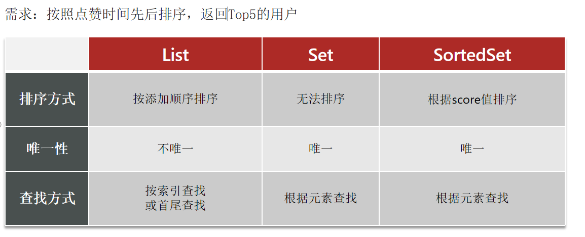
```java
 @Override
    public Result queryBlogLikes(Long id) {
        String key = BLOG_LIKED_KEY + id;
        // 1.查询top5的点赞用户 zrange key 0 4
        Set<String> top5 = stringRedisTemplate.opsForZSet().range(key, 0, 4);
        if (top5 == null || top5.isEmpty()) {
            return Result.ok(Collections.emptyList());
        }
        // 2.解析出其中的用户id
        List<Long> ids = top5.stream().map(Long::valueOf).collect(Collectors.toList());
        String idStr = StrUtil.join(",", ids);
        // 3.根据用户id查询用户 WHERE id IN ( 5 , 1 ) ORDER BY FIELD(id, 5, 1)
        List<UserDTO> userDTOS = userService.query()
                .in("id", ids).last("ORDER BY FIELD(id," + idStr + ")").list()
                .stream()
                .map(user -> BeanUtil.copyProperties(user, UserDTO.class))
                .collect(Collectors.toList());
        // 4.返回
        return Result.ok(userDTOS);
    }
```
## 五、好友关注
* 关注和取关
* 共同关注
* 关注推送

### 1. 关注与取关
```java
 @Override
    public Result follow(Long followUserId, Boolean isFollow) {
        // 1.获取登录用户
        Long userId = UserHolder.getUser().getId();
        String key = "follows:" + userId;
        // 1.判断到底是关注还是取关
        if (isFollow) {
            // 2.关注，新增数据
            Follow follow = new Follow();
            follow.setUserId(userId);
            follow.setFollowUserId(followUserId);
            boolean isSuccess = save(follow);
            if (isSuccess) {
                // 把关注用户的id，放入redis的set集合 sadd userId followerUserId
                stringRedisTemplate.opsForSet().add(key, followUserId.toString());
            }
        } else {
            // 3.取关，删除 delete from tb_follow where user_id = ? and follow_user_id = ?
            boolean isSuccess = remove(new QueryWrapper<Follow>()
                    .eq("user_id", userId).eq("follow_user_id", followUserId));
            if (isSuccess) {
                // 把关注用户的id从Redis集合中移除
                stringRedisTemplate.opsForSet().remove(key, followUserId.toString());
            }
        }
        return Result.ok();
    }

    @Override
    public Result isFollow(Long followUserId) {
        // 1.获取登录用户
        Long userId = UserHolder.getUser().getId();
        // 2.查询是否关注 select count(*) from tb_follow where user_id = ? and follow_user_id = ?
        Integer count = query().eq("user_id", userId).eq("follow_user_id", followUserId).count();
        // 3.判断
        return Result.ok(count > 0);
    }
```
### 2. 共同关注
需求：利用Redis中恰当的数据结构，实现共同关注功能。在博主个人页面展示出当前用户与博主的共同好友。
功能：找到当前登录用户和博主共同关注的好友，分别把用户和博主的id作为key的关注列表集合，再找到这两个集合的交集，使用stringRedisTemplate.opsForSet().intersect
```java,传入用户和博主的key
@Override
    public Result followCommons(Long id) {
        // 1.获取当前用户
        Long userId = UserHolder.getUser().getId();
        String key = "follows:" + userId;
        // 2.求交集
        String key2 = "follows:" + id;
        Set<String> intersect = stringRedisTemplate.opsForSet().intersect(key, key2);
        if (intersect == null || intersect.isEmpty()) {
            // 无交集
            return Result.ok(Collections.emptyList());
        }
        // 3.解析id集合
        List<Long> ids = intersect.stream().map(Long::valueOf).collect(Collectors.toList());
        // 4.查询用户
        List<UserDTO> users = userService.listByIds(ids)
                .stream()
                .map(user -> BeanUtil.copyProperties(user, UserDTO.class))
                .collect(Collectors.toList());
        return Result.ok(users);
    }
```
### 3.关注推送
关注推送也叫做Feed流，直译为投喂。为用户持续的提供“沉浸式”的体验，通过无限下拉刷新获取新的信息。
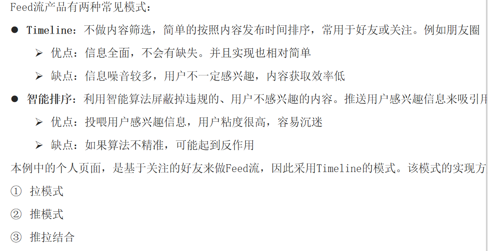
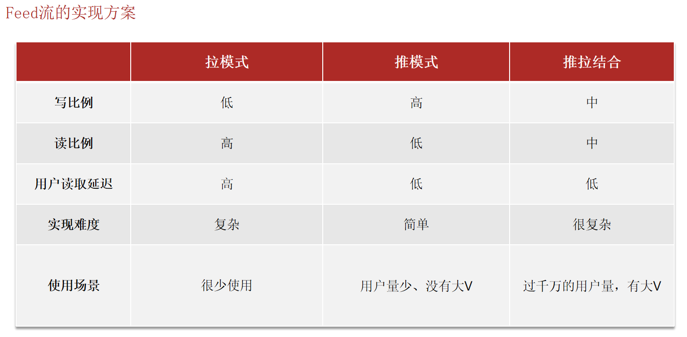
需求：
* 修改新增探店笔记的业务，在保存blog到数据库的同时，推送到粉丝的收件箱
* 收件箱满足可以根据时间戳排序，必须用Redis的数据结构实现
* 查询收件箱数据时，可以实现分页查询
使用了Sorted Set数据结构
```java
 @Override
    public Result saveBlog(Blog blog) {
        // 1.获取登录用户
        UserDTO user = UserHolder.getUser();
        blog.setUserId(user.getId());
        // 2.保存探店笔记
        boolean isSuccess = save(blog);
        if(!isSuccess){
            return Result.fail("新增笔记失败!");
        }
        // 3.查询笔记作者的所有粉丝 select * from tb_follow where follow_user_id = ?
        List<Follow> follows = followService.query().eq("follow_user_id", user.getId()).list();
        // 4.推送笔记id给所有粉丝
        for (Follow follow : follows) {
            // 4.1.获取粉丝id
            Long userId = follow.getUserId();
            // 4.2.推送
            String key = FEED_KEY + userId;
            stringRedisTemplate.opsForZSet().add(key, blog.getId().toString(), System.currentTimeMillis());
        }
        // 5.返回id
        return Result.ok(blog.getId());
    }
```

需求：在个人主页的“关注”卡片中，查询并展示推送的Blog信息：
```java
@Override
    public Result queryBlogOfFollow2(Long max, Integer offset) {

        // 实现关注推送页面的分页查询
        // 获取当前用户ID
        Long userId = UserHolder.getUser().getId();
        // 根据用户查询推送文章
        String key = FEED_KEY + userId;
        Set<ZSetOperations.TypedTuple<String>> typedTuples = stringRedisTemplate.opsForZSet().reverseRangeByScoreWithScores(key, 0, max, offset, 2);
        if (CollectionUtil.isEmpty(typedTuples)) {
            return Result.ok();
        }
        List<Long> blogIds = new ArrayList<>(typedTuples.size());
        int os = 1;
        long minTime = System.currentTimeMillis();
        for (ZSetOperations.TypedTuple<String> typedTuple : typedTuples) {
            // 文章笔记Id
            String value = typedTuple.getValue();
            blogIds.add(Long.valueOf(value));
            long time = typedTuple.getScore().longValue();
            // scope重复 将offset值+1
            if (minTime == time) {
                os++;
            } else {
                // 上次查询记录scope
                minTime = time;
                os = 1;
            }
        }

        String idStr = StrUtil.join(",", blogIds);
        List<Blog> blogList = query().in("id", blogIds).last("ORDER BY FIELD(id," + idStr + ")").list();
        for (Blog blog : blogList) {
            // 5.1.查询blog有关的用户
            queryBlogUser(blog);
            // 5.2.查询blog是否被点赞
            isBlogLiked(blog);
        }

        ScrollResult scrollResult = new ScrollResult();
        scrollResult.setList(blogList);
        scrollResult.setMinTime(minTime);
        scrollResult.setOffset(os);

        return Result.ok(scrollResult);
    }
```

## 六、附近商户
### 1. geo数据结构
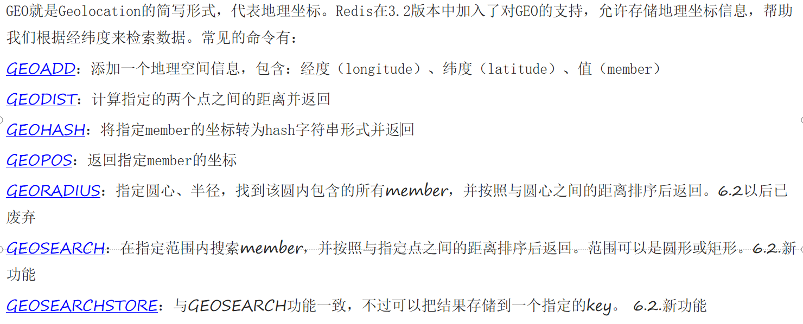

### 2. 附近商户搜索
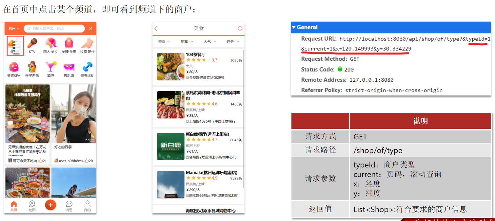
按照商户类型做分组，类型相同的商户作为同一组，以typeId为key存入同一个GEO集合中即可
```java
   @Override
    public Result queryShopByType(Integer typeId, Integer current, Double x, Double y) {
        // 1.判断是否需要根据坐标查询
        if (x == null || y == null) {
            // 不需要坐标查询，按数据库查询
            Page<Shop> page = query()
                    .eq("type_id", typeId)
                    .page(new Page<>(current, SystemConstants.DEFAULT_PAGE_SIZE));
            // 返回数据
            return Result.ok(page.getRecords());
        }

        // 2.计算分页参数
        int from = (current - 1) * SystemConstants.DEFAULT_PAGE_SIZE;
        int end = current * SystemConstants.DEFAULT_PAGE_SIZE;

        // 3.查询redis、按照距离排序、分页。结果：shopId、distance
        String key = SHOP_GEO_KEY + typeId;
        GeoResults<RedisGeoCommands.GeoLocation<String>> results = stringRedisTemplate.opsForGeo() // GEOSEARCH key BYLONLAT x y BYRADIUS 10 WITHDISTANCE
                .search(
                        key,
                        GeoReference.fromCoordinate(x, y),
                        new Distance(5000),
                        RedisGeoCommands.GeoSearchCommandArgs.newGeoSearchArgs().includeDistance().limit(end)
                );
        // 4.解析出id
        if (results == null) {
            return Result.ok(Collections.emptyList());
        }
        List<GeoResult<RedisGeoCommands.GeoLocation<String>>> list = results.getContent();
        if (list.size() <= from) {
            // 没有下一页了，结束
            return Result.ok(Collections.emptyList());
        }
        // 4.1.截取 from ~ end的部分
        List<Long> ids = new ArrayList<>(list.size());
        Map<String, Distance> distanceMap = new HashMap<>(list.size());
        list.stream().skip(from).forEach(result -> {
            // 4.2.获取店铺id
            String shopIdStr = result.getContent().getName();
            ids.add(Long.valueOf(shopIdStr));
            // 4.3.获取距离
            Distance distance = result.getDistance();
            distanceMap.put(shopIdStr, distance);
        });
        // 5.根据id查询Shop
        String idStr = StrUtil.join(",", ids);
        List<Shop> shops = query().in("id", ids).last("ORDER BY FIELD(id," + idStr + ")").list();
        for (Shop shop : shops) {
            shop.setDistance(distanceMap.get(shop.getId().toString()).getValue());
        }
        // 6.返回
        return Result.ok(shops);
    }
``` 

## 七、用户签到
### 1. 签到功能

需求：实现签到接口，将当前用户当天签到信息保存到Redis中
```java
 @Override
    public Result sign() {
        // 1.获取当前登录用户
        Long userId = UserHolder.getUser().getId();
        // 2.获取日期
        LocalDateTime now = LocalDateTime.now();
        // 3.拼接key
        String keySuffix = now.format(DateTimeFormatter.ofPattern(":yyyyMM"));
        String key = USER_SIGN_KEY + userId + keySuffix;
        // 4.获取今天是本月的第几天
        int dayOfMonth = now.getDayOfMonth();
        // 5.写入Redis SETBIT key offset 1
        stringRedisTemplate.opsForValue().setBit(key, dayOfMonth - 1, true);
        return Result.ok();
    }
```
### 2. 签到统计
需求：实现下面接口，统计当前用户截止当前时间在本月的连续签到天数


```java
 @Override
    public Result signCount() {
        // 1.获取当前登录用户
        Long userId = UserHolder.getUser().getId();
        // 2.获取日期
        LocalDateTime now = LocalDateTime.now();
        // 3.拼接key
        String keySuffix = now.format(DateTimeFormatter.ofPattern(":yyyyMM"));
        String key = USER_SIGN_KEY + userId + keySuffix;
        // 4.获取今天是本月的第几天
        int dayOfMonth = now.getDayOfMonth();
        // 5.获取本月截止今天为止的所有的签到记录，返回的是一个十进制的数字 BITFIELD sign:5:202203 GET u14 0
        List<Long> result = stringRedisTemplate.opsForValue().bitField(
                key,
                BitFieldSubCommands.create()
                        .get(BitFieldSubCommands.BitFieldType.unsigned(dayOfMonth)).valueAt(0)
        );
        if (result == null || result.isEmpty()) {
            // 没有任何签到结果
            return Result.ok(0);
        }
        Long num = result.get(0);
        if (num == null || num == 0) {
            return Result.ok(0);
        }
        // 6.循环遍历
        int count = 0;
        while (true) {
            // 6.1.让这个数字与1做与运算，得到数字的最后一个bit位  // 判断这个bit位是否为0
            if ((num & 1) == 0) {
                // 如果为0，说明未签到，结束
                break;
            }else {
                // 如果不为0，说明已签到，计数器+1
                count++;
            }
            // 把数字右移一位，抛弃最后一个bit位，继续下一个bit位
            num >>>= 1;
        }
        return Result.ok(count);
    }

```
### 八、UV统计

实现uv统计
```java
 @Test
    void testHyperLogLog() {
        String[] values = new String[1000];
        int j = 0;
        for (int i = 0; i < 1000000; i++) {
            j = i % 1000;
            values[j] = "user_" + i;
            if(j == 999){
                // 发送到Redis
                stringRedisTemplate.opsForHyperLogLog().add("hl2", values);
            }
        }
        // 统计数量
        Long count = stringRedisTemplate.opsForHyperLogLog().size("hl2");
        System.out.println("count = " + count);
    }
```